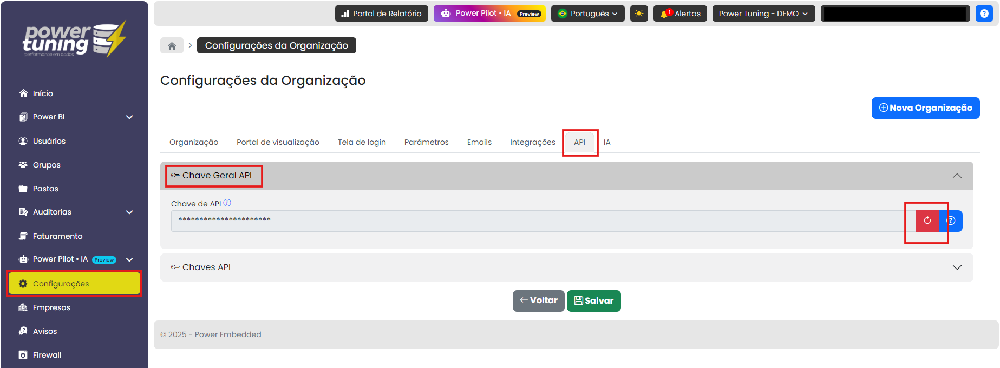
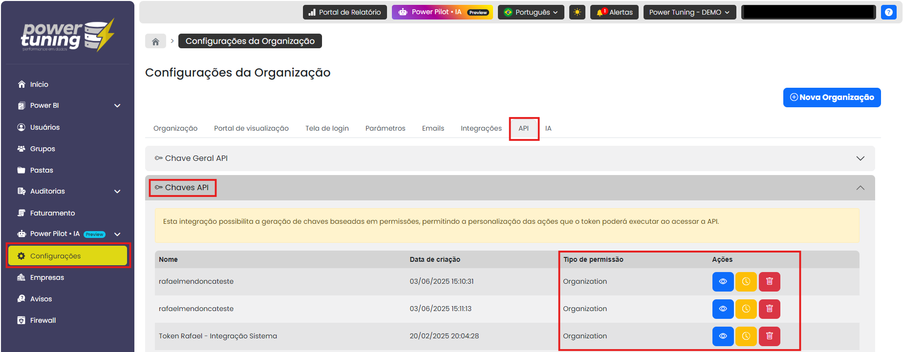

# Automações com APIs

Como obter a Chave de API para autenticação das requisições?

O primeiro passo é obter a chave da API no menu de Configurações do portal de administração.

<figure><figcaption></figcaption></figure>


Também é possível gerar chaves de autenticação baseadas em permissões, com o administrador podendo gerar chaves que permitirão o acesso apenas a um subconjunto dos endpoints.

<figure><figcaption></figcaption></figure>

###

### Gerenciando usuários pela API

A documentação da API pode ser acessada [aqui](https://api.powerembedded.com.br/index.html) Utilizando a rota GET /api/user podemos realizar uma listagem de usuários no sistema.

```
curl -X 'GET' \
  'https://api.powerembedded.com.br/api/user' \
  -H 'accept: application/json' \
  -H 'X-API-Key: HNhlHXAG1g21NyIsIkFwaUtleSI6Ik'
```

Exemplo de resposta do servidor, onde a propriedade "reports" tem associado um array com todos os IDs dos relatórios que meu usuário tem acesso e "groups" aponta para um array com todos os grupos que meu usuário faz parte.

```
{
  "pageIndex": 1,
  "totalPages": 2,
  "hasNextPage": true,
  "hasPreviousPage": false,
  "data": [
    {
      "id": "dd668e6d-4f83-4715-a155-b55213677dd8",
      "email": "tyrion.lannister@casterlyrock.com",
      "name": "Tyrion Lannister",
      "role": 3,
      "reports": [
        "c3aa3e62-7c43-4c0f-ab1d-3f9e0fbbad0e",
        "57e23242-ad69-455b-8955-1a0b4e35e6ed",
        "359a3241-08e2-45d1-b046-78c3c9c7ea8f",
        "7c8a79ec-23d0-4edc-8299-89461e134c34",
        "48dc89e1-240d-4b25-bba2-e8cb2d3d16d4",
        "9339a616-9d09-49dd-a848-3289161b2c2a"
      ],
      "companies": [],
      "groups": [
        "5d47cdd0-bd05-4e27-a87a-45b45da4360e",
        "833e6b83-f157-47ef-9f1f-7545d705c5a1"
      ],
      "reportLandingPage": null,
      "department": "BI ",
      "expirationDate": null,
      "windowsAdUser": null,
      "canEditReport": true,
      "canCreateReport": false,
      "canOverwriteReport": false
    }
  ]
}
```

Para filtrar a lista de usuários por nome e e-mail, basta utilizar os parâmetros de consulta "name" e "email", respectivamente.

```
curl -X 'GET' \
  'https://api.powerembedded.com.br/api/user?name=Jo%C3%A3o%20Macedo&email=joao.macedo%40powertuning.com.br' \
  -H 'accept: application/json' \
  -H 'X-API-Key: HNhlHXAG1g21NyIsIkFwaUtleSI6Ik'
```

Para criar um novo usuário no sistema, utilize a rota POST /api/user. Onde a chave "role" define a [função de usuário](https://docs.powerembedded.com.br/portal-de-administracao/usuarios/tipos-de-funcoes-de-usuario) sendo:

1 = Administrador 2 = Contribuidor 3 = Visualizador 4 = Contribuidor de workspace

```
curl -X 'POST' \
  'https://api.powerembedded.com.br/api/user' \
  -H 'accept: */*' \
  -H 'X-API-Key: HNhlHXAG1g21NyIsIkFwaUtleSI6Ik' \
  -H 'Content-Type: application/json' \
  -d '{
  "email": "joao.macedo@powertuning.com.br",
  "name": "João Macedo",
  "role": 1
}'
```

Para apagar um usuário do sistema, utilize a rota DELETE /api/user/{userEmail}, onde "userEmail" é o e-mail do usuário a ser excluído.

```
curl -X 'DELETE' \
  'https://api.powerembedded.com.br/api/user/joao.macedo%40powertuning.com.br' \
  -H 'accept: */*' \
  -H 'X-API-Key: HNhlHXAG1g21NyIsIkFwaUtleSI6Ik'
```

###

### Controlando permissões em relatórios pela API

Você também pode dar permissão de acesso a um ou mais relatórios para um usuário utilizando a rota POST /api/user/link-reports. Bastar passar os IDs dos relatórios no array "reports" e o e-mail do usuário em "userEmail".

```
curl -X 'PUT' \
  'https://api.powerembedded.com.br/api/user/link-reports' \
  -H 'accept: */*' \
  -H 'X-API-Key: HNhlHXAG1g21NyIsIkFwaUtleSI6Ik' \
  -H 'Content-Type: application/json' \
  -d '{
  "userEmail": "joao.macedo@powertuning.com.br",
  "reports": [
    "3fa85f64-5717-4562-b3fc-2c963f66afa6",
    "2fa8bf64-3615-5162-b3fb-1c963f66afa5"
  ]
}'
```

Para remover a permissão de acesso a um ou mais relatórios, basta utilizar a rota POST /api/user/unlink-reports.

```
curl -X 'PUT' \
  'https://api.powerembedded.com.br/api/user/unlink-reports' \
  -H 'accept: */*' \
  -H 'X-API-Key: HNhlHXAG1g21NyIsIkFwaUtleSI6Ik' \
  -H 'Content-Type: application/json' \
  -d '{
  "userEmail": "joao.macedo@powertuning.com.br",
  "reports": [
    "3fa85f64-5717-4562-b3fc-2c963f66afa6"
  ]
}'
```

###

### Listando os relatórios existentes no Power Embedded

Além de listar usuários, também é possível listar relatórios. Dessa forma é possível ter acesso a alguns metadados, como os IDs dos relatórios. Para isso, basta utilizar a rota GET /api/report.

```
curl -X 'GET' \
  'https://api.powerembedded.com.br/api/report' \
  -H 'accept: application/json' \
  -H 'X-API-Key: HNhlHXAG1g21NyIsIkFwaUtleSI6Ik'
```

Exemplo de resposta do servidor.

```
{
  "pageIndex": 1,
  "totalPages": 3,
  "hasNextPage": true,
  "hasPreviousPage": false,
  "data": [
    {
      "id": "f8dd3f97-be3a-423b-91d5-923da88f5ec6",
      "name": "Relatório de vendas",
      "description": "Relatório com informações de vendas",
      "datasetId": "b6bd5b2b-8983-41b1-970e-aa95bec52f39",
      "embedUrl": "https://app.powerbi.com/reportEmbed?reportId=f8dd3f97-be3a-423b-91d5-923da88f5ec6&groupId=d397e342-a1a0-47e4-94ee-acd6f23ddc52&w=2&config=eyJjbHVzdGVyVXJsIjoiaHR0cHM6Ly9XQUJJLUJSQVpJTC1TT1VUSC1yZWRpcmVjdC5hbmFseXNpcy53aW5kb3dzLm5ldCIsImVtYmVkRmVhdHVyZXMiOnsidXNhZ2VNZXRyaWNzVk5leHQiOnRydWV9fQ%3d%3d",
      "workspaceId": "d397e342-a1a0-47e4-94ee-acd6f23ddc52",
      "reportType": 1,
      "folderId": null,
      "workspaceName": "BI",
      "userOwner": null
    }
  ]
}
```

Assim como no endpoint de usuários, também é possível filtrar o relatório através de parâmetros de consulta. No exemplo abaixo, utilizo os parâmetros "reportName" e "workspaceName".

```
curl -X 'GET' \
  'https://api.powerembedded.com.br/api/report?reportName=Atendimento%20laboratorial&workspaceName=BI' \
  -H 'accept: application/json' \
  -H 'X-API-Key: d397e342-a1a0-47e4-94ee-acd6f23ddc52'
```

Resposta do servidor.

```
{
  "pageIndex": 1,
  "totalPages": 1,
  "hasNextPage": false,
  "hasPreviousPage": false,
  "data": [
    {
      "id": "cb56555d-546c-40a2-b988-b1903cbbe39c",
      "name": "Atendimento Laboratorial",
      "description": null,
      "datasetId": "693527e8-d0d6-4ef0-a570-7213e9ba59bc",
      "embedUrl": "https://app.powerbi.com/reportEmbed?reportId=cb56555d-546c-40a2-b988-b1903cbbe39c&groupId=d397e342-a1a0-47e4-94ee-acd6f23ddc52&w=2&config=eyJjbHVzdGVyVXJsIjoiaHR0cHM6Ly9XQUJJLUJSQVpJTC1TT1VUSC1yZWRpcmVjdC5hbmFseXNpcy53aW5kb3dzLm5ldCIsImVtYmVkRmVhdHVyZXMiOnsidXNhZ2VNZXRyaWNzVk5leHQiOnRydWV9fQ%3d%3d",
      "workspaceId": "d397e342-a1a0-47e4-94ee-acd6f23ddc52",
      "reportType": 1,
      "folderId": null,
      "workspaceName": "BI",
      "userOwner": null
    }
  ]
}
```

###

### Row-Level Security (RLS) utilizando a API

Para listar todas as roles vinculadas aos seus datasets, basta utilizar a rota GET /api/datasets/rls.

```
curl -X 'GET' \
  'https://api.powerembedded.com.br/api/datasets/rls' \
  -H 'accept: application/json' \
  -H 'X-API-Key: d397e342-a1a0-47e4-94ee-acd6f23ddc52'
```

Resposta do servidor.

```
{
  "pageIndex": 1,
  "totalPages": 2,
  "hasNextPage": true,
  "hasPreviousPage": false,
  "data": [
    {
      "id": "213cb3bd-ddf6-4e7b-9707-37859200f938",
      "name": "Admin",
      "users": [
        "b3569847-98af-4d3d-837c-b679afed8f64",
        "ca506817-6bff-4564-81ae-7e3d40c27947",
        "22672557-bb9d-49bd-8f97-e6341390cca0"
      ],
      "groups": [],
      "datasetId": "a57cae24-1073-41e3-818b-b7a82b76cc88",
      "userEmails": [
        "rafael.mendonca@powertuning.com.br",
        "alison.pezzott@powertuning.com.br",
        "dirceu.resende@powertuning.com.br"
      ]
    }
  ]
}
```

Também é possível o uso de parâmetros de consulta. No exemplo abaixo, informei o ID de um dataset no parâmetro "datasetId".

```
curl -X 'GET' \
  'https://api.powerembedded.com.br/api/datasets/rls?datasetId=c07dce01-f9b3-4a5c-be5d-dae7dc39a4fe' \
  -H 'accept: application/json' \
  -H 'X-API-Key: d397e342-a1a0-47e4-94ee-acd6f23ddc52'
```

Resposta do servidor.

```
{
  "pageIndex": 1,
  "totalPages": 1,
  "hasNextPage": false,
  "hasPreviousPage": false,
  "data": [
    {
      "id": "58f4a4ae-d85e-4c60-afdc-e0e26f6f96d5",
      "name": "Geral",
      "users": [],
      "groups": [],
      "datasetId": "c07dce01-f9b3-4a5c-be5d-dae7dc39a4fe",
      "userEmails": []
    },
    {
      "id": "95050ddf-b0c5-4631-9aa8-56eebece752b",
      "name": "Recepcionista15",
      "users": [
        "fabff0b5-73f3-44c8-885d-34445a8df76a",
        "2d60d03d-6bcf-435d-acad-0a3900ce0f6c"
      ],
      "groups": [],
      "datasetId": "c07dce01-f9b3-4a5c-be5d-dae7dc39a4fe",
      "userEmails": [
        "joao.macedo@powertuning.com.br",
        "charlison.oliveira@azurebrasil.cloud"
      ]
    }
  ]
}
```

Para vincular uma função RLS a um usuário ou grupo, pode-se utilizar as rotas PUT /api/datasets/rls/link-users e PUT /api/datasets/rls/link-groups, respectivamente. Para desvincular, /unlink-users e /unlink-groups.

Abaixo um exemplo com PUT /api/datasets/rls/link-users.

```
curl -X 'PUT' \
  'https://api.powerembedded.com.br/api/datasets/rls/link-users' \
  -H 'accept: */*' \
  -H 'X-API-Key: d397e342-a1a0-47e4-94ee-acd6f23ddc52' \
  -H 'Content-Type: application/json' \
  -d '{
  "usersEmails": [
    "joao.macedo@powertuning.com.br"
  ],
  "datasetId": "3fa85f64-5717-4562-b3fc-2c963f66afa6",
  "role": "Admin"
}'
```

###

### Consultando o log de acessos de relatórios do Power Embedded via API

Você também pode utilizar a rota GET /api/report-audit para acessar o log da auditoria de relatórios, consultando todos os acessos a relatórios realizados pelos usuários do Power Embedded.

```
curl -X 'GET' \
  'https://api.powerembedded.com.br/api/report-audit' \
  -H 'accept: application/json' \
  -H 'X-API-Key: d397e342-a1a0-47e4-94ee-acd6f23ddc52'
```

Resposta do servidor.

```
{
  "pageIndex": 1,
  "totalPages": 184,
  "hasNextPage": true,
  "hasPreviousPage": false,
  "data": [
    {
      "id": "fd00daf2-15b4-42f7-b929-3e1a593558ee",
      "createdAt": "2025-10-10T14:09:58.372834Z",
      "organizationId": "4b532635-a0c6-48ae-bea8-a5197c63f057",
      "userId": "c3bc257a-b32b-4979-922e-832ce61b205b",
      "userEmail": "francisco.neto@powertuning.com.br",
      "reportId": "cb56555d-546c-40a2-b988-b1903cbbe39c",
      "reportName": "Atendimento Laboratorial",
      "action": 1,
      "actionName": "TokenRequested"
    }
  ]
}
```

Também é possível filtrar por parâmetros de consulta, como "userEmail", "reportName", "pageNumber", dentre outros.

###

### **Como mostrar os relatórios do Power BI na sua aplicação**


Para saber mais sobre exibição de relatórios em aplicações externas, acesse a página [Mostrar relatórios no seu sistema](mostrar-relatorio-no-seu-sistema.md).



### **Documentação**

Documentação completa da API:\
[Swagger UI (powerembedded.com.br)](https://api.powerembedded.com.br/index.html)

Página de demonstração da API para Embeddar os relatórios:\
[Demo – PowerPortal.IntegrationDemo (powerembedded.com.br)](https://dev.demoapi.powerembedded.com.br/)
