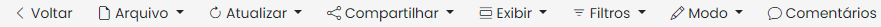
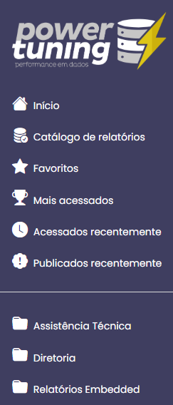
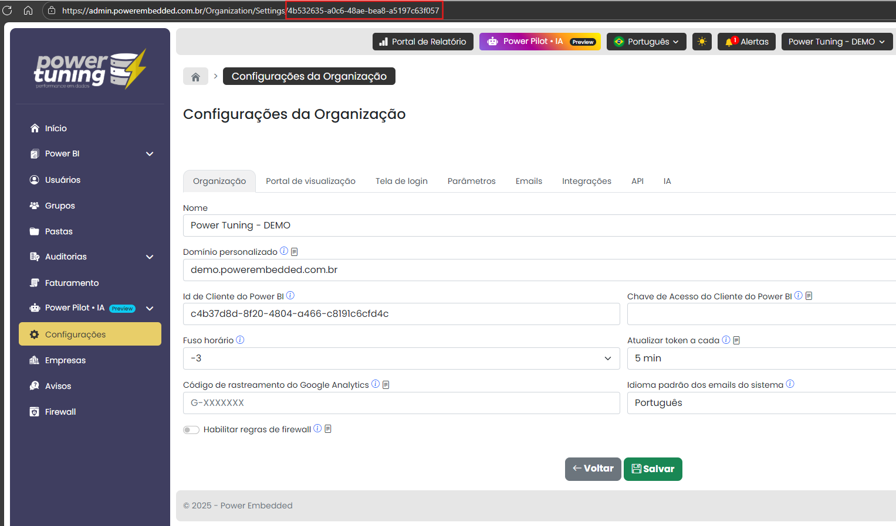
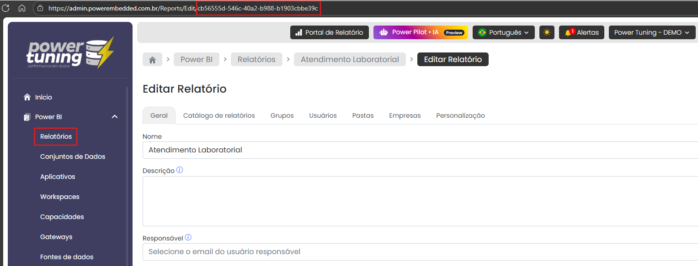

# Mostrar relatório no seu sistema



### Como utilizar o endpoint /identity/url

O primeiro passo é obter a chave da API conforme [esta página](https://docs.powerembedded.com.br/documentacao-tecnica/api/automacoes-com-apis#obtendo-a-chave-de-api). Para retornar a URL que você irá utilizar para acessar o portal de relatórios de forma transparente, sem passar pela tela de login, utilize a rota POST /api/identity/url.

```bash
curl -X 'POST' \
  'https://api.powerembedded.com.br/api/identity/url' \
  -H 'accept: application/json' \
  -H 'X-API-Key: HNhlHXAG1g21NyIsIkFwaUtleSI6Ik' \
  -H 'Content-Type: application/json' \
  -d '{
  "userEmail": "usuario@empresa.com",
}'
```

Segue abaixo o corpo de requisição (body) completo:

```json
{
  "userEmail": "string",
  "baseUrl": "string",
  "organizationId": "string",
  "reportId": "string",
  "hideMenu": bool,
  "hideNavbar": bool,
  "hideSidebar": bool,
  "embed": bool,
  "customFilters": [
    {
      "key": "string",
      "value": "string"
    }
  ]
}
```

### Parâmetros gerais

* userEmail: único campo obrigatório na requisição. Deve ser informado o email da pessoa que está logada no seu sistema. Esse usuário que será gravado nas auditorias e os relatórios que esse usuário tem acesso que serão mostrados na tela. Caso o relatório tenha RLS, este será aplicado automaticamente, utilizando as regras de filtragem desse usuário informado.
* baseUrl: neste campo, você deve preencher com a informação do subdomínio configurado. É obrigatório informar esse dado para que toda a experiência seja personalizada, inclusive no caso de expiração do token.
* Quando os parâmetros de organizationId e reportId NÃO são informados, o portal de visualização completo será renderizado no seu sistema, assim como quando você acessa no modo tradicional (sem API), mostrando apenas os relatórios que o usuário informado possui acesso. O usuário poderá navegar livremente nos relatórios que ele possui acesso.

### Parâmetros para controle de exibição

* hideMenu: oculta a barra de menus quando o relatório é aberto.

<figure><figcaption></figcaption></figure>

* hideNavbar: oculta a barra de navegação quando o relatório é aberto.

<figure><figcaption></figcaption></figure>

* hideSidebar: oculta a barra lateral na tela de navegação.

<figure><figcaption></figcaption></figure>

* embed: é um parâmetro atalho que pode ser utilizado para definir todas as propriedades de exibição acima de uma única vez.
* customFilters: permite abrir relatórios com filtros já aplicados. Mais informações [aqui](https://docs.powerembedded.com.br/documentacao-tecnica/api/filtragem-dinamica).

### Parâmetros para exibição de um relatório apenas

Caso você queira exibir um relatório específico, você precisará informar, obrigatoriamente, os dois parâmetros abaixo:

* organizationId: É o identificador único da sua organização no sistema, fixo e inalterável. Para obtê-lo, acesse o menu "Configurações" e copie o ID na URL.

<figure><figcaption></figcaption></figure>

* reportId: É o ID do relatório, onde cada relatório tem o seu ID único (é o mesmo reportId do relatório no Power BI serviço). Para obter o ID do relatório, capture o ID que fica na URL da tela de edição do relatório.

<figure><figcaption></figcaption></figure>

### Retorno da API

O retorno da API é uma URL com sessão única de 5 minutos.

```json
{
  "embedUrl": "https://demo.powerembedded.com.br/integration/tokenauth?token=c820f277-26ef-44f1-b8ff-46823fbf899d",
  "expiresAt": "2025-10-20T21:14:02.0429464Z"
}
```

Caso você tenha informado os outros parâmetros, como organizationId, reportId (para mostrar apenas um relatório) e os parâmetros de exibição, a requisição terá esse formato.

```bash
curl -X 'POST' \
  'https://api.powerembedded.com.br/api/identity/url' \
  -H 'accept: application/json' \
  -H 'X-API-Key: HNhlHXAG1g21NyIsIkFwaUtleSI6Ik' \
  -H 'Content-Type: application/json' \
  -d '{
  "userEmail": "usuario@empresa.com",
  "baseUrl": "bi.minhaempresa.com",
  "organizationId": "4b532635-a0c6-48ae-bea8-a5197c63f057",
  "reportId": "cb56555d-546c-40a2-b988-b1903cbbe39c"
}'
```

E a URL retornada será algo assim.

```json
{
  "embedUrl": "https://demo.powerembedded.com.br/integration/tokenauth?token=6e87b8e8-f25a-43b4-a8f4-694b9a80a9f0&returnUrl=/Organization/public/6e87b8e8-f25a-43b4-a8f4-694b9a80a9f0",
  "expiresAt": "2025-10-20T21:15:03.492071Z"
}
```

Com a URL gerada, você só precisa criar um iframe utilizando ela como o exemplo abaixo.

```html
<html>
    <iframe width="1200"
            height="800"
            src="https://demo.powerembedded.com.br/integration/tokenauth?token=
            6e87b8e8-f25a-43b4-a8f4-694b9a80a9f0&returnUrl=/Organization/public
            /6e87b8e8-f25a-43b4-a8f4-694b9a80a9f0">
    </iframe>
</html>
```

E com isso, você já consegue mostrar os relatórios do Power BI na sua aplicação, através do Power Embedded, de forma transparente e segura.

Como o token da URL é de uso ÚNICO, essa URL só pode ser acessada uma única vez. Caso você queira mostrar o relatório novamente, terá que executar essa requisição novamente.

Como o token é para o usuário específico, ao acessar um relatório, o Power Embedded sabe quem é o usuário que está acessando e faz as devidas validações de permissão de acesso e aplica as regras de RLS, se configuradas.

### **Documentação**

Documentação completa da API:\
[Swagger UI (powerembedded.com.br)](https://api.powerembedded.com.br/index.html)

Página de demonstração da API para Embeddar os relatórios:\
[Demo – PowerPortal.IntegrationDemo (powerembedded.com.br)](https://dev.demoapi.powerembedded.com.br/)
