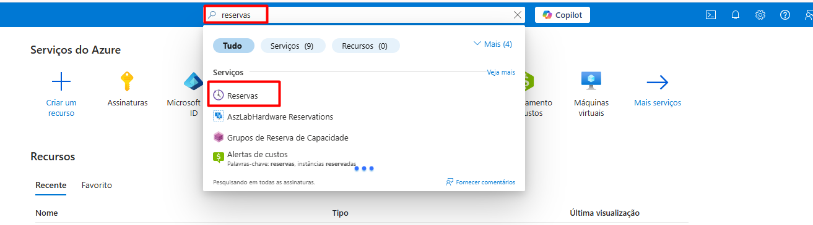
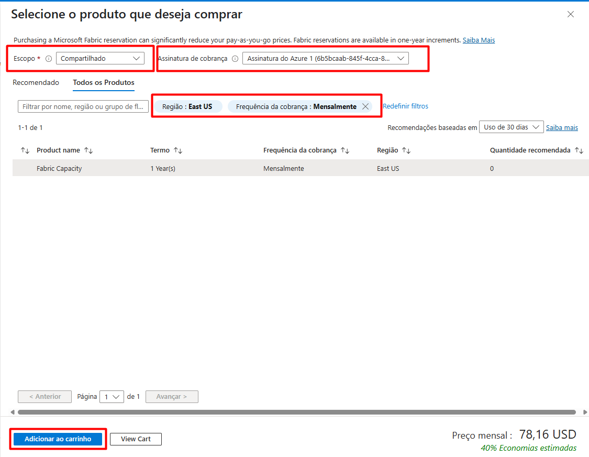
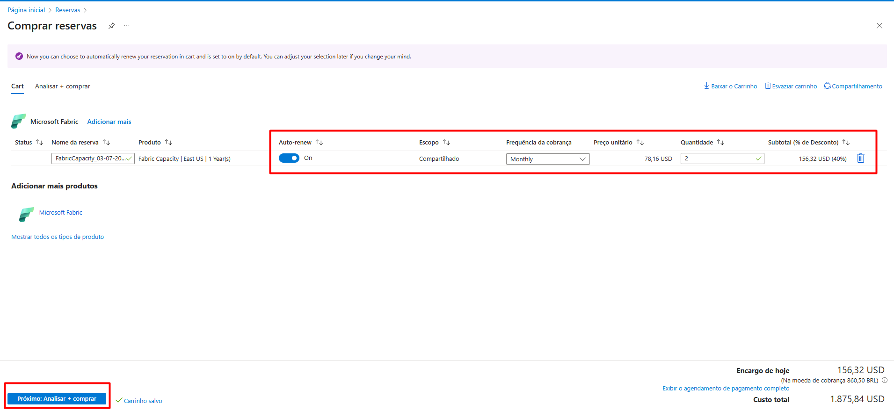

# Ativando a Instância Reservada no Fabric

### Pré Requisitos&#x20;

• Ter uma assinatura paga da Microsoft e Fabric configurado;

• Ser administrador do Portal da Azure

### Passo a Passo:

Acessar o portal Azure [http://portal.azure.com](http://portal.azure.com)  e pesquisar por "**RESERVAS"**

<figure><figcaption></figcaption></figure>

Clicar em comprar agora ou Adicionar&#x20;

<figure><figcaption></figcaption></figure>

Pesquisar por **Fabric** e seleciona lo.&#x20;

Feito isso, você vai na assinatura correta no canto superior direito. Além disso, é necessário verificar se o escopo está como **COMPARTILHADO**, se a **REGIÂO** está correta (East US, Brazil South, Etc) e se a frequência de cobrança está como **MENSAL**.&#x20;

Em seguida view Cart para visualizar o carrinho.

<figure><figcaption></figcaption></figure>

Nessa próxima tela, será necessário indicar quantas **CU(s)** será colocada em reserva, esse processo precisa ser feito manualmente e aceita quaisquer valores, então a atenção é essencial.

Caso seja reservada uma **F2, o campo quantidade será 2, se for uma F4, será 4** e assim sucessivamente.

Observar também se os campos de **Escopo** está como **compartilhado** e a frequência da cobrança está como **monthly**, conforme imagem abaixo.

<figure><figcaption></figcaption></figure>

Feito isso, é só **finalizar a compra**.&#x20;

Pronto, sua capacidade Fabric está em uma instância reservada.
