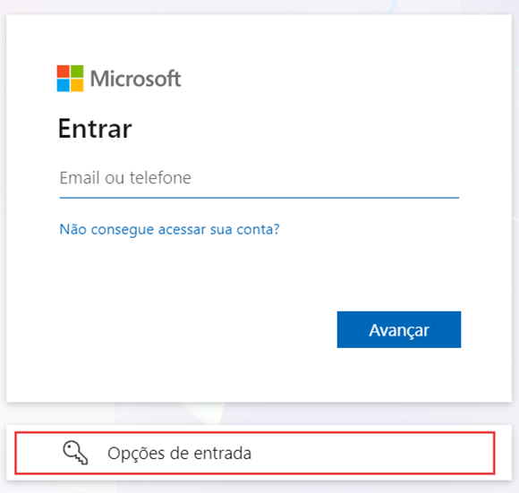

# Pré-Requisitos para a Instalação

Para agendar a instalação do Power Embedded e iniciar o período de avaliação de 30 dias, por favor, utilize o link abaixo:

[**https://powerembedded.com.br/instalacao**](https://powerembedded.com.br/instalacao)

## O que é o processo de instalação

Para que a instalação seja realizada com sucesso, é necessário a presença de uma pessoa que seja administradora do portal do Azure ([https://portal.azure.com/](https://portal.azure.com/)) e alguém que consiga acessar as configurações de locatário do Power BI ([https://app.powerbi.com/admin-portal/tenantSettings](https://app.powerbi.com/admin-portal/tenantSettings)).

Vamos realizar todos os passos abaixo juntos, durante essa reunião de instalação, mas apenas para conhecimento, seguem as permissões necessárias para a instalação, seguem atividades que iremos realizar no Azure AD (alguém com permissão “Azure Global Administrator” deve executar):

* Criar um aplicativo no AD (Acessar a tela de registros de aplicativos)
* Criar um novo grupo no AD
* Adicionar esse usuário neste grupo
* Criar o recurso do Power BI Embedded ou Fabric pelo Azure (opcional se for utilizar o Trial do Fabric)
* Adicionar o Service Principal recém-criado na role “Contributor” no recurso criado (opcional se for utilizar o Trial do Fabric)
* Adicionar o Service Principal recém-criado como “Power BI Capacity Administrator” do recurso criado  (opcional se for utilizar o Trial do Fabric)
* Logar na área administrativa do Power Embedded ([admin.powerembedded.com.br](https://admin.powerembedded.com.br/)), autorizar o aplicativo na sua organização (vai abrir um pop-up no primeiro acesso solicitando o consentimento) e criar os primeiros usuários com perfil de Administrador.
* Logar no portal de visualização do Power Embedded ([relatorios.powerembedded.com.br](https://relatorios.powerembedded.com.br/)) e autorizar o aplicativo na sua organização (vai abrir um pop-up no primeiro acesso solicitando o consentimento).

&#x20;

Seguem atividades que iremos realizar no portal de Administração do Power BI (alguém com permissão “Fabric Administrador” deve executar):

* Habilitar as configurações abaixo e permitir o grupo do AD criado a utilizar essas configurações:
  * Inserir conteúdo em aplicativos
  * As entidades de serviço podem usar APIs do Fabric
  * As entidades de serviço podem acessar APIs de administrador somente leitura
  * Aprimorar as respostas das APIs de administração com metadados detalhados
  * Permitir pontos de extremidade XMLA e analisar no Excel com modelos semânticos locais
* Associar os workspaces ao recurso da capacidade contratada ou da trial (ou criar novos workspaces para migrar em paralelo)
* Adicionar o grupo do AD criado como administrador dos workspaces

## Permissões necessárias do Power Embedded

### Permissões no Entra ID

**Microsoft Graph**:

<table><thead><tr><th width="139">Permissão</th><th width="358">Descrição</th><th width="102">Tipo</th><th>Consentimento</th></tr></thead><tbody><tr><td>User.Read</td><td>Permissão padrão para ler os dados do usuário logado na aplicação</td><td>Delegado</td><td>Não</td></tr><tr><td>User.Read.All <strong>(Opcional)</strong></td><td>Necessário apenas se for importar/sincronizar usuários com Entra ID</td><td>Aplicação</td><td>Sim</td></tr><tr><td>Group.Read.All <strong>(Opcional)</strong></td><td>Necessário apenas se for importar/sincronizar usuários com Entra ID</td><td>Aplicação</td><td>Sim</td></tr></tbody></table>

<figure><figcaption></figcaption></figure>

### Permissões no Portal de Administração do Power BI

<figure><figcaption></figcaption></figure>

Permissões necessárias:

* As entidades de serviço podem usar APIs do Fabric
* As entidades de serviço podem acessar APIs de administrador somente leitura
* Aprimorar as respostas das APIs de administração com metadados detalhados
* Aprimorar as respostas das APIs de administração com as expressões DAX e mashup
* Inserir conteúdo em aplicativos (já vem ativado por padrão)
* Permitir pontos de extremidade XMLA e analisar no Excel com modelos semânticos locais (já vem ativado por padrão)

Permissões opcionais:

* Exportar para Excel (Necessário caso queira permitir exportar dados do relatório para Excel pelo portal)
* Exportar para .csv (Necessário caso queira permitir exportar dados do relatório para CSV pelo portal)
* Exportar relatório como apresentações em Power Point ou documentos PDF (necessário caso queira permitir exportar relatórios ou criar assinaturas por email no formato PDF ou Power Point)
* Exportar os relatórios como arquivos de imagem (necessário caso queira permitir exportar relatórios no formato de Imagem/PNG)

### Permissões na capacidade Fabric ou Power BI Embedded

## Links úteis

[Documentação técnica da instalação](trial-do-fabric.md)

[Site principal do Power Embedded](https://powerembedded.com.br)

[Série de vídeos sobre o Power Embedded](https://powerembedded.com.br/videos)

[Calculadora do Power Embedded para estimar o custo da solução para o seu ambiente](https://powerembedded.com.br/calculadora)

