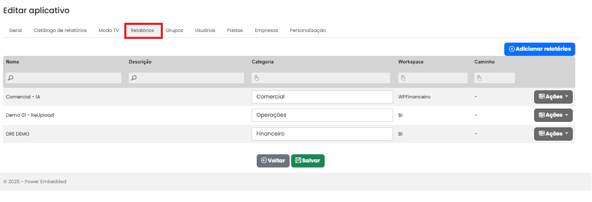
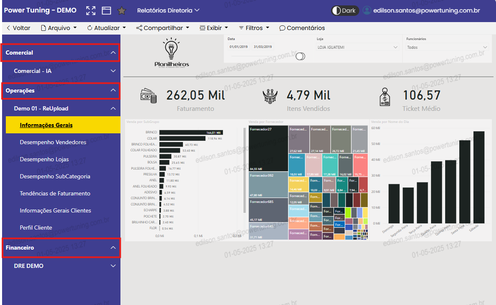
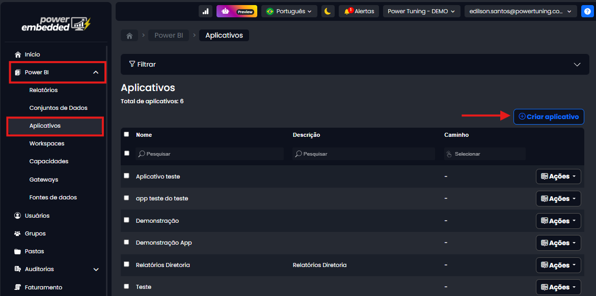
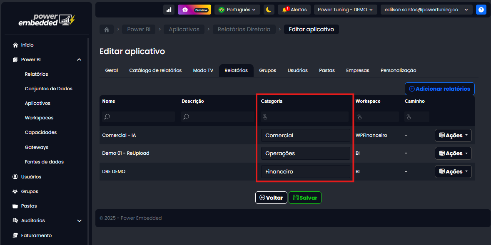

# Relatórios

Nesse menu, é possível importar os relatórios para dentro do aplicativo e escolher a posição e até quais abas dos relatórios você gostaria de mostrar.

<figure><figcaption></figcaption></figure>

No botão de ações, é disponível algumas funcionalidades.

<figure><figcaption></figcaption></figure>

**Páginas:** No aplicativo do Power Embedded, é possível escolher quais abas do relatório serão disponibilizadas.

<figure><figcaption></figcaption></figure>

**Mover:** Para escolher a posição que o relatório ficara disponível no aplicativo.

Organizar Relatórios por categoria

Com essa funcionalide, é possível **classificar os relatórios por temas**, como _Financeiro_, _Comercial_, _Operacional_, entre outros — facilitando a organização, a busca e o consumo das informações por parte dos usuários finais.

<figure><figcaption></figcaption></figure>

**Exemplo de uso:**

* Um mesmo aplicativo pode conter relatórios financeiros, operacionais e de RH — cada um agrupado na sua respectiva categoria.
* O usuário acessa o app e já visualiza os relatórios organizados por seções, tornando a navegação mais intuitiva.

#### Como configurar categorias nos aplicativos

Para configurar categorias nos relatórios de um aplicativo, siga os passos abaixo:

1. Acesse o **portal de administração e** vá até a aba **Power BI** e clique em **Aplicativos, em seguida você pode ou clica em Criar Ou Ações para Editar**

<figure><figcaption></figcaption></figure>

2\. Na aba de Relatórios existe um novo campo, o campo de Categorias, onde você consegue criar categorias ou usufruir de categorias existentes

<figure><figcaption></figcaption></figure>

Assim, os relatórios dentro do aplicativo aparecerão organizados de acordo com as categorias definidas.

