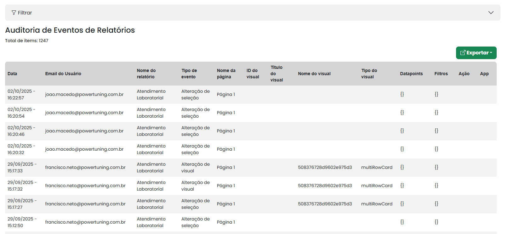
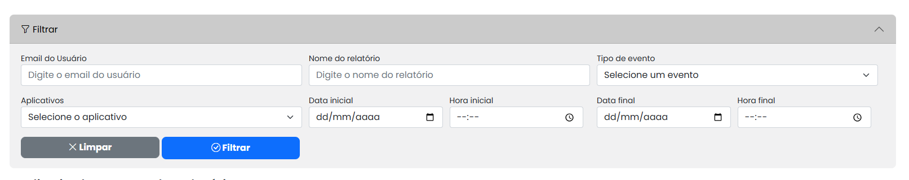
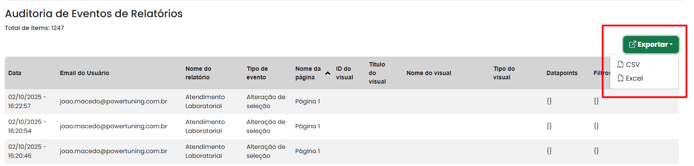

# Eventos de Relatório

A auditoria de eventos de relatório permite registrar e acompanhar todas as interações capturadas nos relatorios. Ela garante que cada evento seja documentado com precisão, incluindo informações como data, hora, e-mail do usuário, nome do relatório, tipo de evento, nome da pagina, Id do visual, titulo do visual, nome do visual e etc.&#x20;

<figure><figcaption></figcaption></figure>

### Filtrar

É possível filtrar por emaild e usuaario, nome do relatorio, tipo de evento. aplicativos data inicial e final e hora inicial e final.

<figure><figcaption></figcaption></figure>

### Exportar

O administrador também pode exportar esses resultados para CSV ou Excel, caso deseje realizar uma análise no Power BI ou no Excel.

<figure><figcaption></figcaption></figure>
