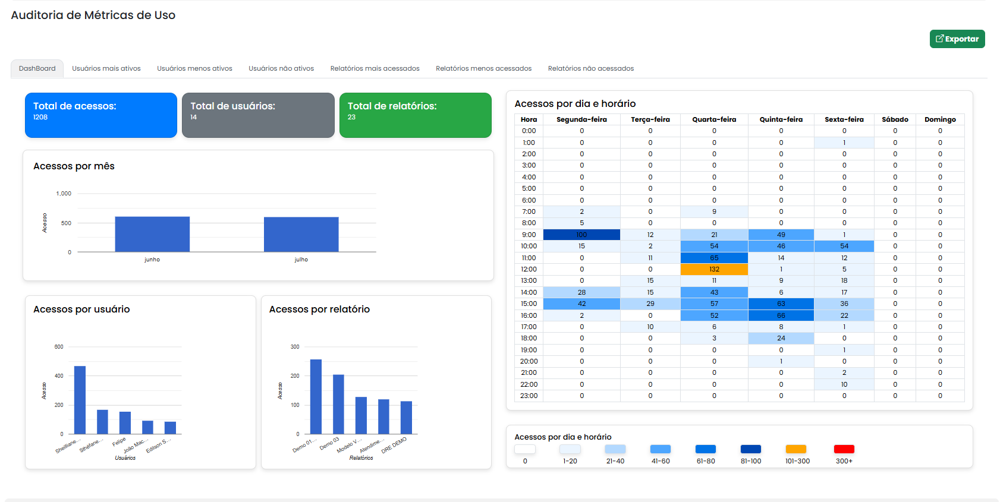
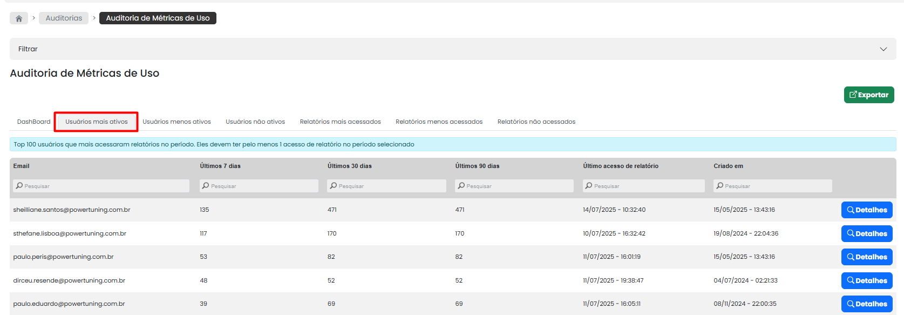
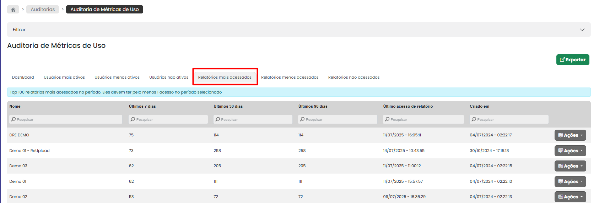
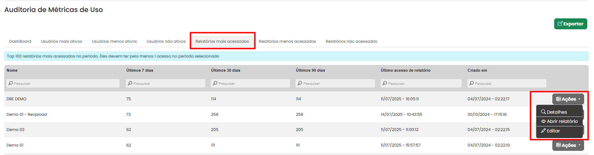

# Métrica de Uso

### Auditoria de Métricas de Uso

A auditoria de métricas de uso agrupa os dados de acesso aos relatórios, permitindo uma visão consolidada em vez de visualizar cada acesso individualmente.\
\
Essa auditoria ajuda muito na gestão de governança e monitoramento do portal, ajudando a identificar os usuários utilizados no portal e os relatórios que estão sendo acessados e os que não são acessados mais.\
\
A auditoria de métricas de uso é composta por seis abas:

1. Dashboard&#x20;
2. Usuários mais ativos
3. Usuários menos ativos
4. Usuários não ativos
5. Relatórios mais acessados
6. Relatórios menos acessados
7. Relatórios nunca acessados

### DashBoard

Oferece  uma visão detalhada sobre o desempenho e a utilização do portal de forma simples e direta. Em vez de criar relatórios manuais o que normalmente demanda tempo, esse dashboard já fornece os dados prontos e organizados, permitindo que os usuários acompanhem informações importantes com facilidade.

<figure><figcaption></figcaption></figure>

&#x20;As métricas disponíveis incluem:

1. **Total de Acessos**: Mostra o número total de vezes que o portal foi acessado em um período específico, permitindo analisar a frequência de uso.
2. **Total de Usuários**: Exibe o número total de usuários cadastrados no portal.
3. **Total de Relatórios**: Informa quantos relatórios estão publicados no portal.
4. **Acesso por mês**: Permite visualizar o total de acessos por mês.
5. **Acesso por Usuário**: Mostra o número de acessos por usuário, permitindo analisar a frequência de uso individual e identificar usuários mais ativos.
6. **Acesso por Relatório**: Indica quantas vezes aquele relatório foi acessado

### Usuários mais ativos

Retorna um ranking dos 100 usuários mais ativos nos últimos 7 dias, ou seja, aqueles que mais abriram relatórios nesse período. Para aparecer nesse ranking, o usuário deve ter pelo menos um acesso a relatórios.\
\
A plataforma também fornece informações sobre os acessos nos últimos 7/30/90 dias, além da data da última vez que o usuário acessou um relatório.

Como todas as outras telas do sistema, é possível aplicar o filtro pela barrinha cinza. Como os campos também são numéricos, é possível fazer o filtro de número (quantidade) que eu quero visualizar e também posso usar da seguinte forma: “**> (maior) 100**” e ele retorna.

Em “Detalhes”, é possível visualizar todas as auditorias de relatório, permitindo a navegação por todos os relatórios acessados pelo usuário no portal de visualização.

<figure><figcaption></figcaption></figure>

### Usuários menos ativos

Retorna um ranking dos 100 usuários menos ativos nos últimos 7 dias, ou seja, aqueles que menos abriram relatórios nesse período.&#x20;

Assim como em usuários mais ativos, a plataforma também fornece informações sobre os acessos nos últimos 7/30/90 dias, além da data da última vez que o usuário acessou o relatório.

### Usuários não ativos

Usuários que foram criados no portal e nunca acessaram nenhum relatório são um forte indicador de contas que podem precisar ser revisadas.&#x20;

Como a cobrança é feita por usuário, é importante avaliar se é necessário manter esses usuários ativos no sistema para otimizar os custos.

### Relatórios mais acessados

Retorna um ranking dos 100 relatórios mais acessados nos últimos 7/30/90 dias.

É possível fazer também uma ordenação na coluna crescente ou decrescente, da maneira como achar melhor para visualizar.

Essa mesma visão que temos para usuários também está disponível para relatórios.

É possível visualizar os relatórios mais acessados, menos acessados e nunca acessados.

Como todas as outras telas do sistema, é possível aplicar o filtro pela barrinha cinza. Como os campos também são numéricos, é possível fazer o filtro de número (quantidade) que eu quero visualizar e também posso usar da seguinte forma: **“> (maior) 100”** e ele retorna.

Em “Detalhes”, é possível visualizar todos os usuários que acessaram o relatório e aplicar filtro, facilitando a busca por usuário.

<figure><figcaption></figcaption></figure>

### Relatórios menos acessados

É a visão inversa do mais acessados. Ou seja, vai trazer uma lista dos 20 relatórios menos acessados nos últimos 7/30/90 dias e a data do último acesso desse relatório.

### Relatórios não acessados

São relatórios importados para a plataforma e desde então nunca foi acessado por nenhum usuário.&#x20;

Esse é um indicador muito forte para validar se esses relatórios fazem sentido ainda manter criados no próprio Power BI serviço. Muitas vezes, há relatórios que precisam ser mantidos em funcionamento, mas que demoram muito para atualizar e ninguém está acessando

Isso também pode ser um problema de permissão, pois ao importar o relatório, pode ter ocorrido o esquecimento de conceder permissões aos usuários, resultando em ninguém visualizando o relatório.&#x20;

Então vale esse tipo de análise para saber se a permissão está OK ou se realmente ninguém acessa esse relatório.

Uma vantagem do Power Embedded é que é possível visualizar para todos os relatórios importados, independente se está tudo em um workspace só ou espalhado em dezenas de workspaces diferentes.

### Botão de Ações:

Para ampliar ainda mais a usabilidade, adicionamos o botão **“Ações”** em abas estratégicas, permitindo maior eficiência na gestão de usuários e relatórios.

Você poderá realizar ações rápidas nas seguintes seções:

* **Usuários menos ativos e não ativos**
* **Relatórios mais acessados, menos acessados e nunca acessados**

<figure><figcaption></figcaption></figure>

### Funcionalidades:

O botão “Ações” oferece diferentes opções conforme a seção em que é utilizado.

1. **Gestão de Usuários ( menos ativos/ não ativos)**&#x20;
   * **Detalhes**: Redireciona para a tela de **Auditoria de Relatórios**, onde é possível visualizar o registro completo dos logs dos usuários.
   * **Editar**: Permite editar diretamente o perfil do usuário selecionado.
   * **Remover**: Exclui o usuário da lista, evitando a necessidade de procurá-lo manualmente.\
     \

2. **Gestão de relatórios ( mais acessados/ menos acessados / nunca acessados)**&#x20;
   * **Detalhes**: Direciona para a tela de **Auditoria de Relatórios**, onde é possível consultar o histórico completo de acessos.
   * **Abrir Relatório**: Acessa diretamente o relatório no portal de visualizações.
   * **Editar**: Permite editar rapidamente o relatório, facilitando ajustes e melhorias.
   * **Remover** : Exclui o relatório do portal, garantindo uma gestão mais eficiente dos conteúdos disponíveis.
