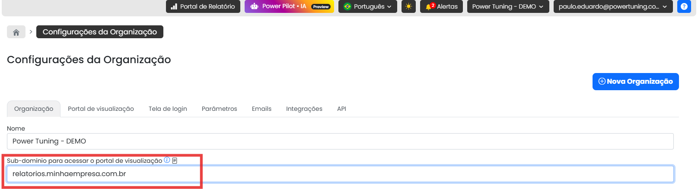

# Configuração do DNS

O **Power Embedded** é uma plataforma **SaaS no formato white-label**, permitindo que cada cliente personalize totalmente sua experiência. Além de cores e imagens, é possível definir uma **URL de acesso personalizada** para o sistema.

### Criação dos registros no DNS

Para acessar o sistema com uma URL personalizada, há duas opções disponíveis:

1. **Utilizar um domínio próprio** → Exemplo: bi.suaempresa.com.br
2. **Utilizar o domínio do Power Embedded** → Exemplo: suaempresa.powerembedded.com.br

Se optar por um domínio próprio, será necessário adicionar dois registros ao seu DNS: As entradas (CNAME e TXT) para ser possível utilizar essa URL personalizada no Power Embedded:

| Tipo  | Nome     | Valor                                                            |
| ----- | -------- | ---------------------------------------------------------------- |
| CNAME | bi       | powerportal-client.azurewebsites.net                             |
| TXT   | asuid.bi | D1B15490F13A639D57FF7985A837F7E5242DD6F062BEEC8698E3CC36A6CBD693 |

O exemplo acima é para quando você está configurando o subdomínio bi.suaempresa.com.br

### Exemplo de Configuração

Se a URL personalizada for bi.suaempresa.com.br, utilize os valores acima. Caso deseje um nome diferente, como relatorios.minhaempresa.com.br, apenas o campo "Nome" mudará:

* CNAME → Nome: "relatorios"
* TXT → Nome: "asuid.relatorios"

Os valores da coluna "Valor" permanecem os mesmos.


Após realizar as configurações indicadas, lembre-se de comunicar o time de suporte do Power Embedded para que eles realizem a liberação no sistema.

Utilize o site [DNSChecker](https://dnschecker.org/) para verificar se a criação dos registros no DNS já foi propagada.


### Configurando a Nova URL no Power Embedded

Após a liberação do suporte, siga os passos abaixo para finalizar a configuração:

1. Acesse a página de **Configurações** no Power Embedded.
2. Insira o **subdomínio personalizado** no campo correspondente.

<figure><figcaption></figcaption></figure>

### Como configurar em outras plataformas

<table data-view="cards"><thead><tr><th></th><th></th><th></th><th data-hidden data-card-target data-type="content-ref"></th></tr></thead><tbody><tr><td><strong>Cloudflare</strong></td><td>Aprenda a configurar</td><td></td><td><a href="configuracao-do-dns-no-cloudflare.md">configuracao-do-dns-no-cloudflare.md</a></td></tr></tbody></table>
