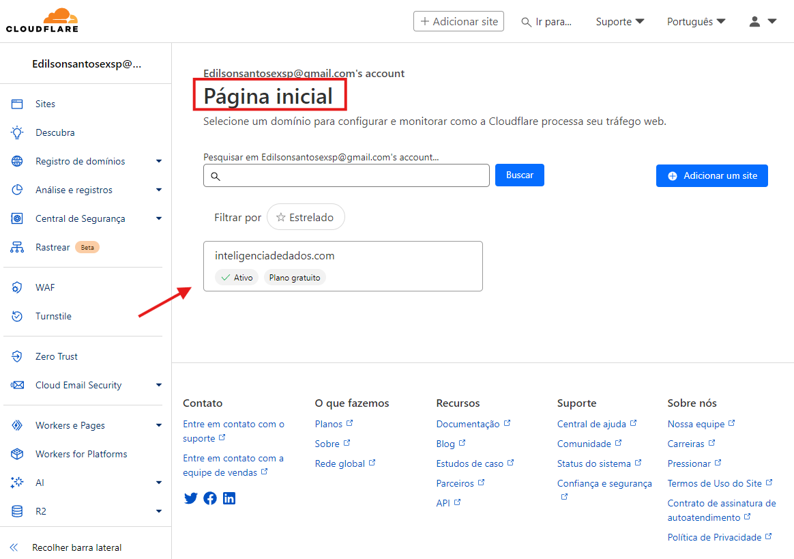
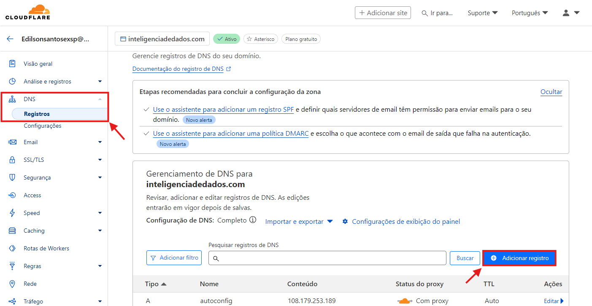
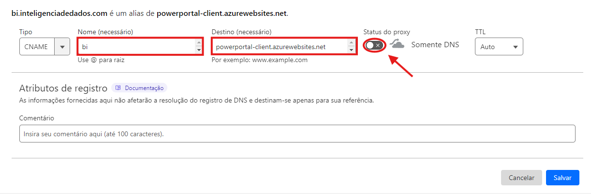
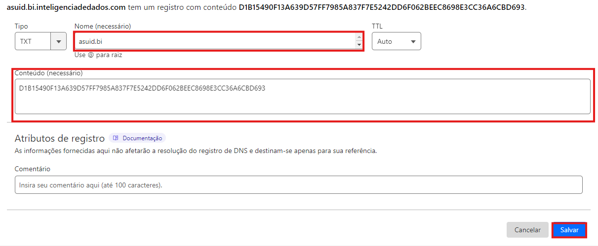

# Configuração do DNS no Cloudflare

Se você gerencia seu DNS pelo Cloudflare e precisa adicionar os registros TXT e CNAME, siga o passo a passo abaixo:

&#x20;**1. Acesse a Cloudflare:** [Clique aqui](https://dash.cloudflare.com/) para acessar o site da Cloudflare e na página inicial da Cloudflare, clique no seu domínio.

<figure><figcaption></figcaption></figure>

&#x20;

**2.** No menu lateral, clique na opção **DNS** e depois em **Registros**.

3\. Na tela que foi aberta, clique no botão Adicionar registro.

<figure><figcaption></figcaption></figure>

&#x20;

**4.** Na tela de adicionar registros DNS, selecione o tipo CNAME, digite o nome do subdomínio desejado, insira o valor powerportal-client.azurewebsites.net no campo Destino, desative a opção Status do proxy e salve as alterações.

O campo **Nome** é que vai definir o endereço do subdomínio. Se você digitar **“bi”**, a URL de acesso será bi.seudomini

**5.** Clique novamente em **Adicionar registro** e selecione o tipo **TXT**.&#x20;

Insira o valor asuid.bi no campo **Nome**, o valor fornecido para o TXT (D1B15490F13A639D57FF7985A837F7E5242DD6F062BEEC8698E3CC36A6CBD693) no campo **Conteúdo** e salve as alterações.

Caso o seu subdomínio não seja “bi”, você deverá alterar o valor do campo Nome para o padrão asuid.seu\_subdominio, ou seja, se quiser que se chame powerbi.seudominio.com.br, o valor esse campo deverá ser asuid.powerbi

### Preocupações com segurança ao desativar o proxy do DNS do registro CNAME

Para realizar a configuração de um domínio personalizado em uma aplicação web hospedada no Azure App Service, utilizando HTTPS e permitir que o Azure valide a posse do domínio e finalize a configuração corretamente, é necessário que o subdomínio em questão esteja com o proxy da Cloudflare desativado temporariamente (modo "DNS Only").

Durante a associação de domínios personalizados, o Azure realiza verificações DNS diretas para validar a propriedade e vincular corretamente o domínio ao App Service. Se o proxy da Cloudflare estiver ativado (nuvem laranja), ele interfere na resolução esperada pelo Azure, impedindo a conclusão do processo. Em outras palavras, o Azure precisa verificar a propriedade do domínio diretamente, sem a intermediação do proxy da Cloudflare, que mascara o destino real do tráfego.

A desativação temporária do proxy não compromete a segurança da aplicação, pois o domínio ainda estará sob a gestão da Cloudflare, com proteção contra ataques ao DNS. O tráfego permanecerá criptografado via HTTPS, com certificado gerenciado pelo Azure. E após a ativação do domínio, o proxy poderá ser reativado normalmente, se desejado.

Esse procedimento é amplamente documentado e utilizado por empresas que integram domínios personalizados com o Azure, AWS ou GCP. Inclusive, a própria Microsoft recomenda esse ajuste temporário em sua documentação oficial sobre binding de domínios no App Service.

<figure><figcaption>
<a href="https://learn.microsoft.com/en-us/azure/api-management/configure-custom-domain?tabs=custom#dns-configuration">https://learn.microsoft.com/en-us/azure/api-management/configure-custom-domain?tabs=custom#dns-configuration</a>
</figcaption></figure>

Estamos controlando esse processo cuidadosamente. A desativação do proxy será apenas durante o período de ativação do domínio. Após a associação ser concluída e validada, avaliaremos a reativação do proxy Cloudflare para proteção adicional (CDN e WAF), se compatível com a aplicação.
