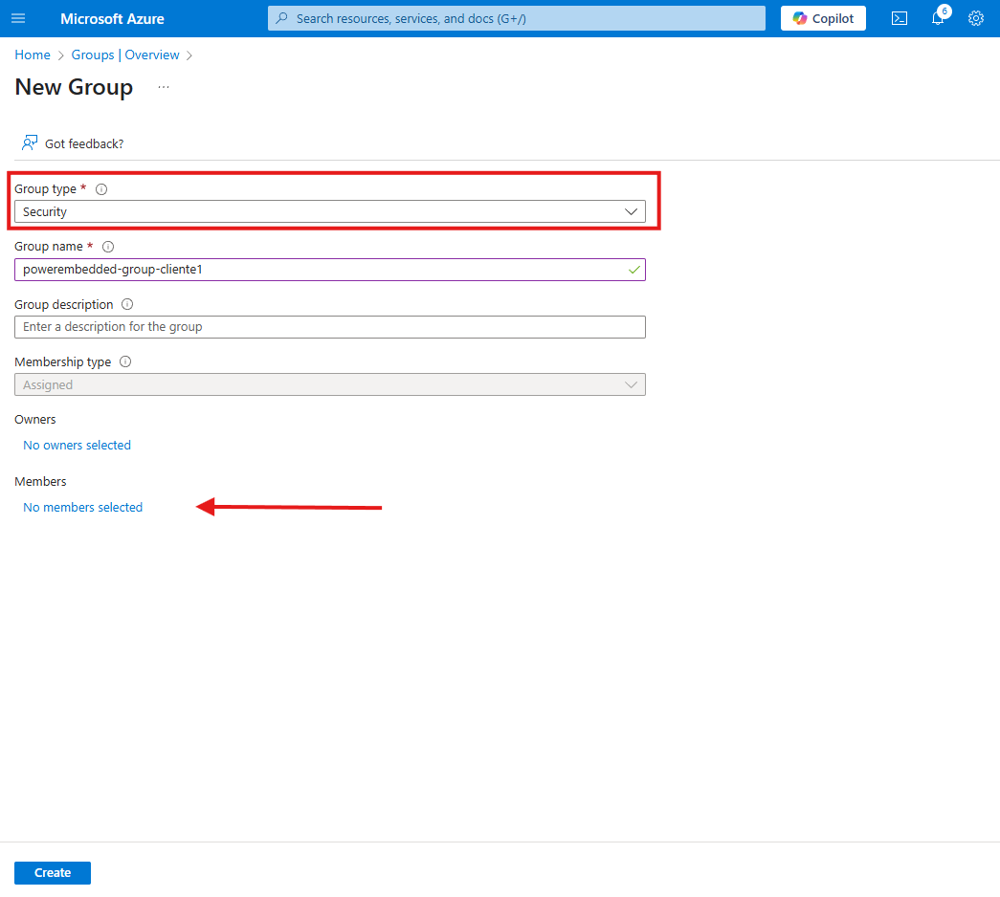

# Multi Organizações

**Mesmo Service Principal para varias organizações:** Bastante utilizado quando você quer ter dois cnpj cadastrados e ter faturamento diferente, ou até mesmo quando você que criar portais de administração  separados, como o gerenciamento de usuários, auditorias, firewall mas sem se preocupar que as organizações veja os mesmo workspaces.

**Service Principals diferentes para cada organização:** Bastante utilizado quando você quer ter uma granularidade maior no controle, muito util para quando você quer terceiriar a gestão do portal de administração como todo, desde de limitar quais workspace pode visualizar, usuarios, capacidade etc.\

Para entender como funciona esse processo na prática, leia abaixo:

### 1. Mesma Service Principal para várias organizações

Use esse método quando você deseja compartilhar capacidade, permissões de workspaces e configurações de administração entre todas as organizações.

#### Etapas de configuração

1. **Criar a nova organização**
   * Acesse **Portal de Administração > Configurações > Nova organização**.
   * Preencha os dados básicos (nome, nome fantasia, CNPJ...)

<figure><figcaption></figcaption></figure>

No campo ID de cliente do Power BI e Chave de Acesso, precisamos ir lá no Azure pegar esses valores. Siga as etapas abaixo.

Para isso clique no link: [Registro de aplicativos](https://portal.azure.com/#view/Microsoft_AAD_IAM/ActiveDirectoryMenuBlade/~/RegisteredApps)

Nessa tela busque pelo usuário der serviço criado no momento da instalação, por padrão é powerembedded-app, ao encontrar  clique sobre ele.

<figure><figcaption></figcaption></figure>

Nessa nova aba, copie o nome do aplicativo cliente e cole isso em bloco de notas pois iremos utilizar ele no campo ID de cliente do Power BI.

<figure><figcaption></figcaption></figure>

Agora precisamos criar outro segredo do cliente, se estiver com esse valor guardado em algum lugar não precisa criar outra chave, mas se for preciso pode criar outro.

Vá em Certificates & Secrets > New Client secret.

<figure><figcaption></figcaption></figure>

Em **Certificates & Secrets**, adicione um novo segredo (expiração: 730 dias)

<figure><figcaption></figcaption></figure>

Agora copie esse valor e cole em um bloco de notas, pois ao sair dessa tela o mesmo não poderá ser copiado.&#x20;


Importante: Ao criar outra chave, é preciso adicionar esse novo valor na organização já existente.


<figure><figcaption></figcaption></figure>

Finalizado esse processo, basta volta no menu de Criação de organização e preencher os campos.


Quando finalizar a criação da nova organização utilizando o mesmo service principal, automaticamente os mesmo workspace irão ser exibidos na nova organização pois estamos utilizando o mesmo para as diferentes organizações


### 2. Utilizando _Service Principals_ diferentes

Essa opção é recomendada quando você deseja que **as organizações estejam completamente separadas**, mesmo que estejam dentro do mesmo tenant.

#### &#x20;Cenários comuns:

* Consultorias que oferecem Power Embedded para diferentes clientes.
* Cada cliente pode importar relatórios, cadastrar usuários, definir permissões, tudo isso **sem acessar os workspaces de outras organizações**.

#### Exemplo:

Imagine que você é uma consultoria e quer oferecer o serviço de Power Embedded. Seu cliente "Cliente 1" quer importar seus próprios relatórios, gerenciar seus usuários e permissões, mas sem ver qualquer conteúdo de outros clientes.

#### Como configurar:

Vá ao portal do **Azure** e acesse o menu [Registro de Aplicativos](https://portal.azure.com/#view/Microsoft_AAD_IAM/ActiveDirectoryMenuBlade/~/RegisteredApps) no **Entra ID**.

Em vez de buscar o Service Principal existente, clique em New Register para criar um novo.

<figure><figcaption></figcaption></figure>

Defina um nome — recomendamos seguir o padrão `PowerEmbedded-App-NomeDoCliente`, por exemplo: `PowerEmbedded-App-Cliente1`.

O tipo de conta é a Single Tenant e pode clicar em Register

<figure><figcaption></figcaption></figure>

Nessa nova aba, copie o Application (Client) ID e cole isso em bloco de notas pois iremos utilizar ele no campo ID de cliente do Power BI.

<figure><figcaption></figcaption></figure>

Agora precisamos criar segredo do cliente.

Vá em Certificates & Secrets > New Client secret.

<figure><figcaption></figcaption></figure>

Defina uma descrição e em **Expires** escolha a opção de **730 Days (24 Months)**

<figure><figcaption></figcaption></figure>

Após criar copie esse valor utilizando a opção indicada para evitar erros, e cole no bloco de notas junto com o **Application (Client ID)**

Feito esse processo, agora iremos criar um novo grupo para definir as permissões no portal de administração no Power BI.


Você pode utilizar o grupo da organização principal, pois esse grupo ele serve para habilitar as permissões padrão para utilizar o Power Embedded, mas caso decida criar vários grupos para organizações diferentes não tem problema, lembrando que ao criar grupos diferentes precisa habilitar as permissões no Power BI. [Permissões Power BI](../../../documentacao-tecnica/instalacao/)


Caso precise criar um grupo de segurança individual para o service principal clica no tópico abaixo para expandir.

Criar grupo de segurança Azure

Para criar o grupo de segurança [clique aqui ](https://portal.azure.com/#view/Microsoft_AAD_IAM/GroupsManagementMenuBlade/~/AllGroups)

Nessa tela clique em **New Group**

<figure><figcaption></figcaption></figure>

Nessa tela defina o tipo de grupo que é por padrão Security e em seguida defina um nome para esse grupo, utilize como padrão esse **Powerembedded-app-nomecliente**

Agora, Adicione o **Service Principal recém-criado** como membro do grupo.

<figure><figcaption></figcaption></figure>

Nessa nova tela busque pelo Powerembedded-app-cliente1, clique no checkbox e clique em selecionar.

<figure><figcaption></figcaption></figure>

Com o grupo criado, é muito importante agora acessar o portal de administração do Power Bi e definir as permissões para esse grupo. [Permissões Power BI](../../../documentacao-tecnica/instalacao/)

### Adicione o Service Principal como administrador do Workspace

Acesse o workspace correspondente ao cliente e:

* Adicione o `PowerEmbedded-App-Cliente1` como administrador.
* Certifique-se de que o workspace está atribuído à capacidade (malha ou avaliação).

<figure><figcaption></figcaption></figure>

Agora, no Power Embedded, vá até a criação de uma nova organização e:

* Informe o **ID do cliente Power BI** com o `Application ID` que você copiou.
* Informe a **chave de acesso** com o `Client Secret`.

Clique em **Criar Organização**

<figure><figcaption></figcaption></figure>

> ✅ Pronto! Agora você tem duas organizações dentro do mesmo tenant, **com permissões separadas** e controle granular por cliente.

## Pontos Importantes sobre Multi Organizações

Custos por organização

* **Valor por usuário:** R$ 5,00/mês
* **Mínimo por organização:** 20 usuários (R$ 100,00/mês)

> **Observação:** se uma organização tiver menos de 20 usuários, o custo mensal mínimo continuará sendo R$ 100,00.
>
> Se o mesmo usuário for cadastrado em mais de uma organização ele será cobrado normalmente.

Alternativas para controle granular sem criar novas organizações

*   **Empresas**&#x20;

    * Permite agrupar relatórios e portais com identidades visuais distintas, mantendo uma única organização.

    [Funcionalidade de empresas](https://docs.powerembedded.com.br/portal-de-administracao/empresas)\

- **Contribuidor de Workspace**
  * Use roles específicas para limitar o acesso a todos os workspace do portal de administração. Com a função de contribuidor de workspace você consegue liberar o acesso do usuário ao portal de admin sem precisa ter acesso full aos workspace

