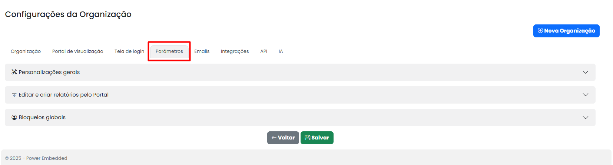

# Parâmetros

<figure><figcaption></figcaption></figure>

## Personalizações Gerais:

**Botões de Ajuda:**

<figure><figcaption></figcaption></figure>

Para oferecer uma experiência de usuário ainda mais aprimorada, o portal inclui um botão de ajuda disponível em cada página. Este botão fornece acesso a uma documentação abrangente e detalhada sobre o Power Embedded.

<figure><figcaption></figcaption></figure>

Se você deseja redirecionar o usuário para uma página específica, é possível configurar um link para isso. Ao inserir uma URL em um link de ajuda, você pode garantir que, ao clicar nesse link, o usuário será automaticamente direcionado para a página desejada, como, por exemplo, uma página interna da empresa\
\
Ambos os portais possuem um botão de ajuda em todas as telas para os usuários usarem em caso de dúvidas.

No entanto, o cliente também pode controlar como melhor utilizar essas funcionalidades. Sempre pensando em oferecer uma solução personalizada para o cliente, oferecemos redirecionamento para nosso portal de ajuda.

Além disso, o cliente pode configurar um domínio para isso.

## Editar e Criar relatórios pelo portal:

<figure><figcaption></figcaption></figure>

#### Enviar notificações quando um relatório for criado ou alterado

Se você habilitar esta opção, todos os relatórios que forem criados ou modificados serão notificados por e-mail.

#### Quais eventos notificar

Conforme mencionado acima, é possível selecionar quais ações deseja ser notificado, podendo escolher entre criar ou somente em caso de alteração, ou ambos.

**Quais perfis de usuários deverão ser notificados**

Para direcionar melhor as informações, também é possível escolher quais perfis serão notificados, podendo escolher todos os três, se desejar. Essa notificação é enviada tanto no email, quanto no próprio portal de administração.

**Importar relatórios automaticamente**

Com essa opção ativada, se um usuário criar ou alterar um relatório e salvar uma cópia, a cópia será importada automaticamente para o portal.

Por padrão, essa cópia é salva no Workspace do relatório original e, sem essa permissão habilitada, seria necessário fazer a importação manualmente.

Nesse caso, uma notificação será enviada no e-mail e no portal informando sobre relatórios pendentes.

Ao clicar na notificação, você será redirecionado para uma tela de importação e análise do relatório, como mostrado na imagem abaixo.

<figure><figcaption></figcaption></figure>

A partir disso, você consegue ter uma governança para analisar e verificar o que o usuário criou ou editou, podendo importar ou rejeitar esses relatórios. Além disso, nessa mesma permissão, existem outras funcionalidades relacionadas.

Nesta opção, existem três possibilidades:

<figure><figcaption></figcaption></figure>

* **Apenas importar o relatório?** O relatório será importado sem nenhuma permissão e será necessário atribuir quais usuários irão visualizar.
* **Copiar permissões do relatório original:** As mesmas permissões que o relatório origem tem, essa cópia herda.
* **Importar e dar permissão a quem criou:** O relatório é importado automaticamente com o acesso somente de quem criou.

**Importar relatório para a mesma pasta do relatório original**

Caso esta opção esteja habilitada, o relatório será automaticamente importado para a mesma pasta do relatório original.
