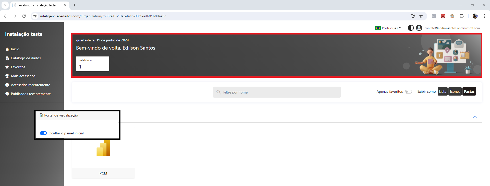
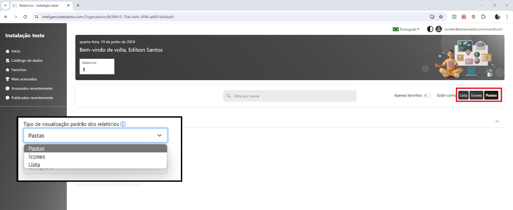
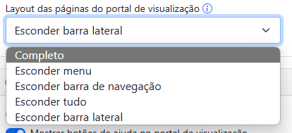
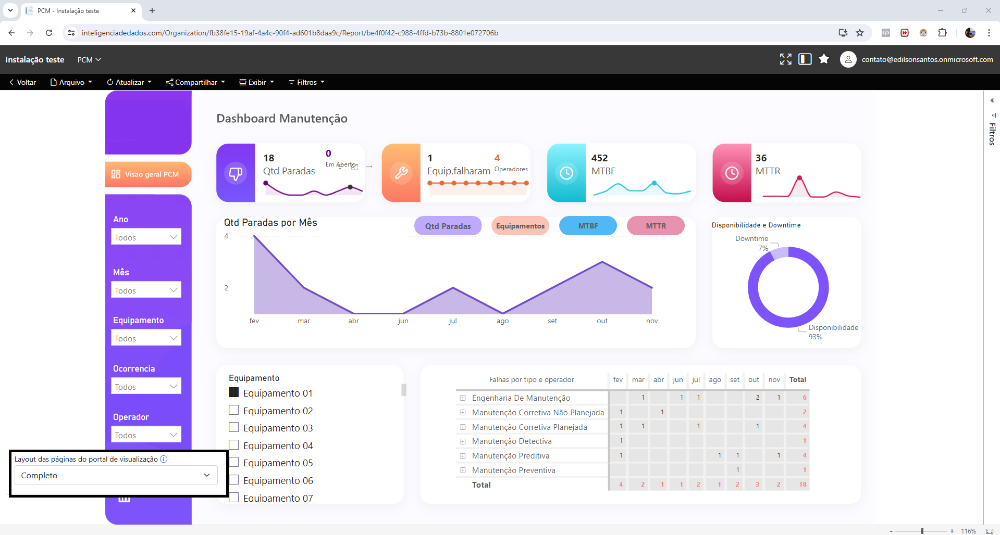
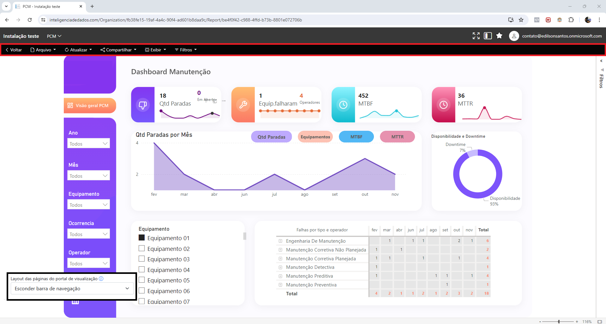
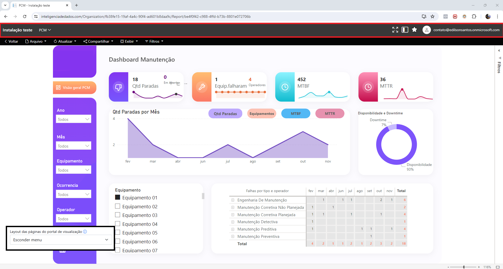
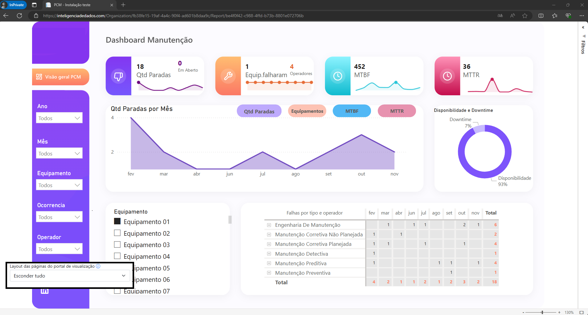
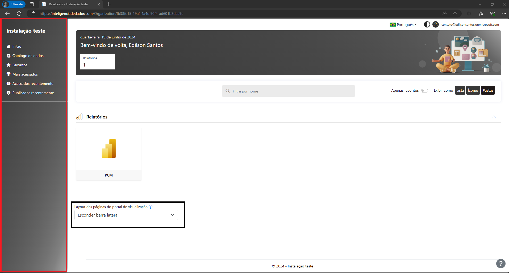
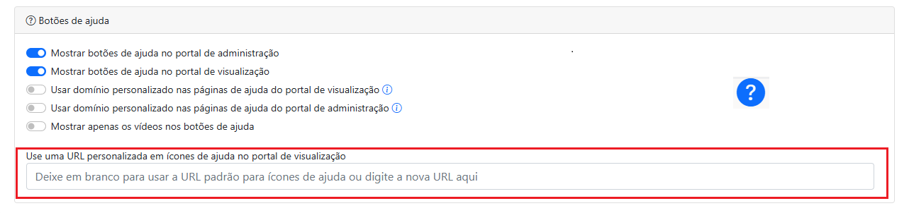

# Personalizações gerais

Ao expandir esse menu é possível visualizar algumas funcionalidades, abaixo iremos detalhar melhor suas funções.

### **Ocultar o painel inicial**

Ao habilitar essa funcionalidade, o painel de visões é ocultado.

<figure><figcaption></figcaption></figure>

### **Abrir os relatórios em uma nova aba**

Ao habilitar essa funcionalidade, seu relatório abrirá em outra aba no navegador por padrão.

### **Tipo de visualização padrão dos relatórios**

– Pastas\
– Ícones\
– Listas

Você pode definir qual vai ser a visualização padrão que o usuário vai ter ao acessar o portal.

<figure><figcaption></figcaption></figure>

### Tipo de visualização das pastas

No Power Embedded, é possível escolher o tipo de visualização das pastas no portal de relatórios.

<figure><figcaption>
Pastas no modo "Retângulo pequeno"
</figcaption></figure>

 

<figure><figcaption>
Pastas no modo "Cartão"
</figcaption></figure>

### **Layout das páginas do portal de visualização**

Esse drop-down permite definir quais elementos serão visualizados na tela, dentro do portão de visualização e de um relatório.

<figure><figcaption></figcaption></figure>

Segue abaixo cada elemento que vai ser oculto.

**Completo:** Todos os elementos estão disponíveis na tela.

<figure><figcaption></figcaption></figure>

**Esconder Menu:**

<figure><figcaption></figcaption></figure>

**Esconder barra de navegação:**

<figure><figcaption></figcaption></figure>

**Esconder tudo:**

<figure><figcaption></figcaption></figure>

**Esconder barra lateral:**

<figure><figcaption></figcaption></figure>

### **Botões de ajuda**

Para oferecer uma experiência de usuário ainda mais aprimorada, o portal inclui um botão de ajuda disponível em cada página. Este botão fornece acesso a uma documentação abrangente e detalhada sobre o Power Embedded.

<figure><figcaption></figcaption></figure>

Se você deseja redirecionar o usuário para uma página específica, é possível configurar um link para isso. Ao inserir uma URL em um link de ajuda, você pode garantir que, ao clicar nesse link, o usuário será automaticamente direcionado para a página desejada, como, por exemplo, uma página interna da empresa.

Ambos os portais possuem um botão de ajuda em todas as telas para os usuários usarem em caso de dúvidas.

No entanto, o cliente também pode controlar como melhor utilizar essas funcionalidades. Sempre pensando em oferecer uma solução personalizada para o cliente, oferecemos redirecionamento para nosso portal de ajuda.

Além disso, o cliente pode configurar um domínio para isso.
