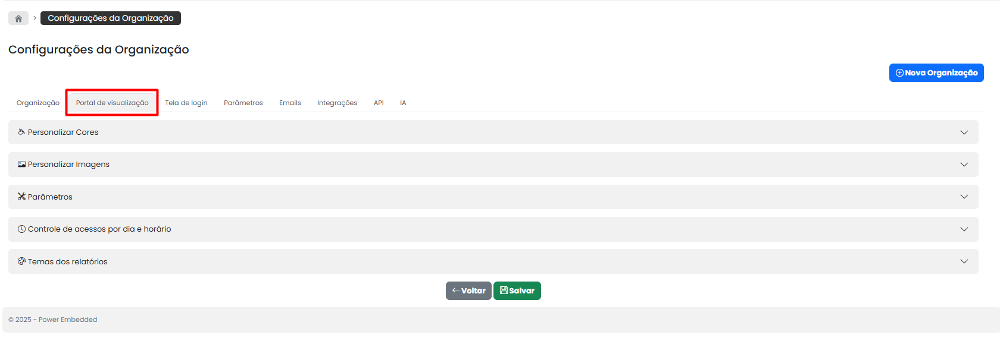

# Portal de visualização

O **Power Embedded** é um portal totalmente personalizável, _white-lab&#x65;_&#x6C;, que permite adaptar a plataforma à identidade visual da sua empresa.

Nesta tela, você pode configurar todos os elementos visuais do portal, proporcionando uma experiência única e coerente com a sua marca..

<figure><figcaption></figcaption></figure>

### Dentro da Aba "Portal de Visualização" você poderá:&#x20;

1. **Personalizar Cores**\
   Defina a paleta de cores principal do portal, incluindo cores de fundo, botões, menus e textos, garantindo uma navegação alinhada com a identidade visual da sua empresa.
2. **Personalizar Imagens**\
   Faça o upload de logotipo, favicon, imagem de fundo da tela de login, entre outras imagens que ajudam a reforçar a identidade da marca dentro da plataforma.
3. **Configurar Parâmetros**\
   Ajuste detalhes técnicos e visuais, como exibição de logotipo no cabeçalho, visibilidade de menus, rodapé, e outros comportamentos personalizados.
4. **Controle de acessos por dia e horário**\
   Defina regras para limitar o acesso ao portal conforme dias da semana e horários específicos, aumentando a segurança e o controle de uso da ferramenta.
5. **Temas dos relatórios**\
   Padronize a aparência dos relatórios exibidos no portal, aplicando cores, estilos de texto e fundo que combinem com o tema geral da sua organização.
