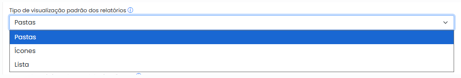
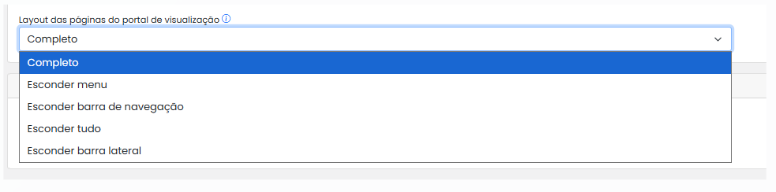
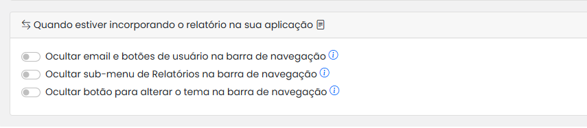

# Parâmetro

A seção **Parâmetros** permite ao administrador ajustar o comportamento visual e funcional do portal de visualização, de acordo com as preferências da organização e com a experiência desejada para o usuário final.

<figure><figcaption></figcaption></figure>

## _Geral:_

* **Ocultar botão do Power Pilot caso o usuário não tenha acesso a nenhum assistente**\
  Oculta o botão do Power Pilot para usuários que não tem acesso ao assistente
* **Ocultar o painel inicial**\
  Remove o primeiro painel, onde descreve o nome e indicadores.
* **Abrir os relatórios em uma nova aba**\
  Quando ativado, os relatórios são abertos em uma nova aba do navegador.
* **Mostrar informações do responsável no catálogo de relatórios**\
  Exibe o nome do responsável pelo relatório diretamente no catálogo.
* **Mostrar miniatura no catálogo de relatórios**\
  Ativa a exibição para as miniaturas em miniatura do relatório/app no catálogo de relatórios
* **Mostrar uma janela com os avisos após o login**\
  Exibe alertas ou mensagens de boas-vindas automaticamente após o login.

## Visualização padrão dos relatórios:

**Tipo de visualização padrão dos relatórios**\
Define como os relatórios serão apresentados por padrão:

* Pastas
* Lista
* Ícones

<figure><figcaption></figcaption></figure>

**Tipo de Visualização das pastas:**

* Cartão
* Retângulo pequeno

**Layout das páginas do portal de visualização**\
Define o modelo de layout aplicado ao portal:

* Completo
* Esconder Menu
* Esconder Barra de Navegação
* Esconder tudo
* Esconder barra lateral

<figure><figcaption></figcaption></figure>

## Quando estiver incorporando o relatório  na sua aplicação:

Configurações específicas para quando o relatório for incorporado em outra aplicação.&#x20;

* **Ocultar Email e botões na barra de navegação** \
  Com essa opção habilitada, o sistema irá ocultar o sub menu dos relatórios.
* **Ocultar sub- menu de relatórios na barra de navegação**\
  Com essa opção habilitada, o sistema oculta o email do usuário na barra de navegação e os botões de alterar senha e sair.
* **Ocultar botão para alterar o tema na barra de navegação**\
  Com essa opção selecionada, o sistema irá ocultar os botões para alterar o tema entre claro e escuro.

<figure><figcaption></figcaption></figure>
