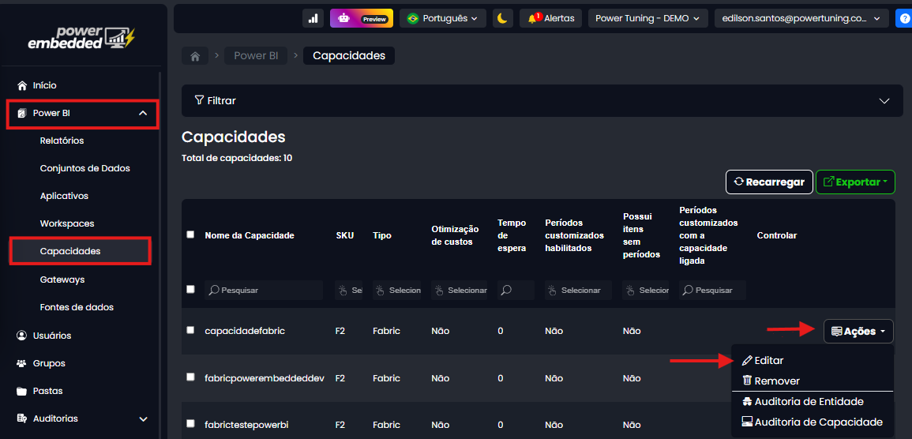

# Personalizar texto ao ligar por demanda

A funcionalidade de controle de capacidade no portal — que permite ligar e desligar a capacidade por demanda, você já conhece. Pensando em tornar o portal ainda mais personalizado para cada cliente, adicionamos uma nova melhoria: é possível editar a mensagem exibida durante o processo de ativação da capacidade sob demanda.

Essa é a visualização apresentada ao usuário quando ele tenta acessar um relatório fora do horário em que a capacidade está desativada

<figure><figcaption></figcaption></figure>

Antes, essa mensagem era fixa, informando apenas que a capacidade está sendo retomada. Com essa opção de personalizar, o cliente pode **personalizar esse texto**, adaptando a linguagem conforme a identidade da empresa — seja com um tom mais informal, instruções adicionais, ou mensagens específicas para os usuários finais.

Essa melhoria torna a experiência mais acolhedora, profissional e alinhada à comunicação da organização.

#### Como configurar o texto personalizado

**Passo 1: Acesse o portal de administração**

Vá até o menu de Capacidades > Ações > Editar

<figure><figcaption></figcaption></figure>

**Passo 2: Personalize o texto**

Vá até a guia de personalização e escreve o texto do seu agrado.

<figure><figcaption></figcaption></figure>

**Passo 3: Salve**

Após salvar, a próxima vez que o seu usuário acessar por demanda a nova mensagem irá ser exibida
