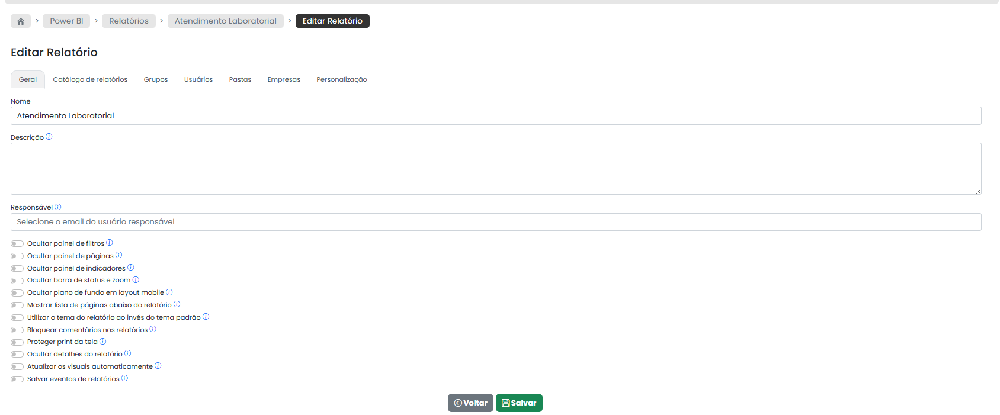
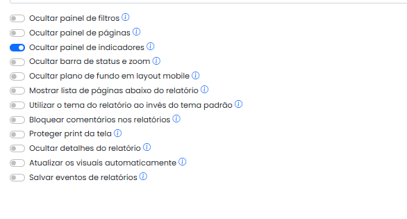
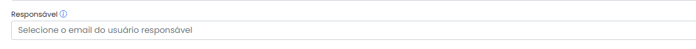
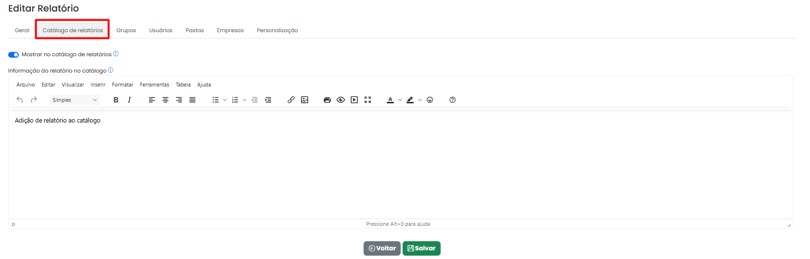
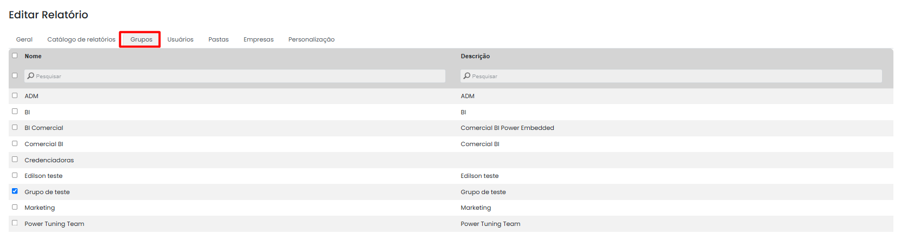
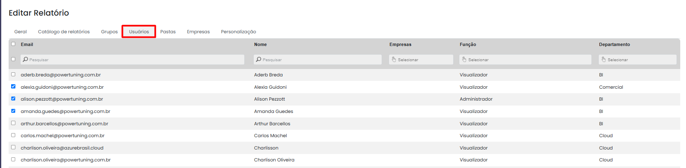
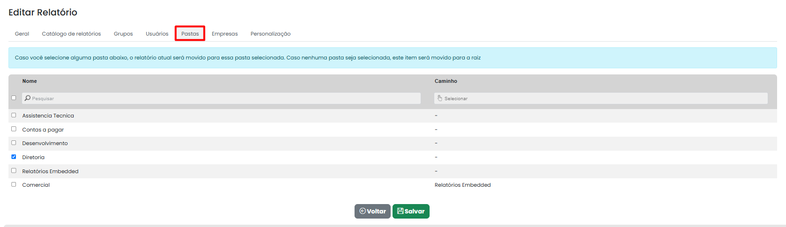
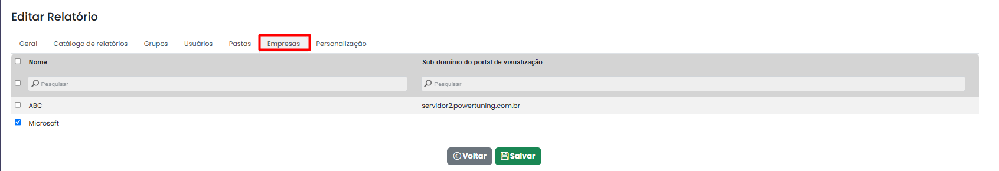
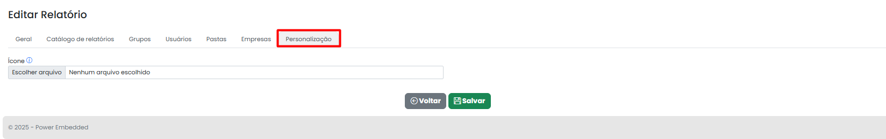

# Editar relatório



<figure><figcaption></figcaption></figure>

**Nome** – Nesse campo é possível renomear o relatório.\
\
**Descrição** – Uma descrição é crucial para garantir o melhor uso das informações do dashboard, pois fornece contexto e orientação sobre o que os dados representam, como interpretá-los e quais insights podem ser extraídos.

#### **Configurações do relatório**

Nesse campo voce encontrá opções para configuração do relatório selecionado, como ocultação de filtros, paginas, indicadores e etc.

<figure><figcaption></figcaption></figure>

**Responsável:** Essa opção permite definir um responsável pelo relatório e facilitar o contato do usuário que está visualizando o relatório com a pessoa responsável pelo relatório.

<figure><figcaption></figcaption></figure>

**Catálogo de relatórios:** É uma ferramenta de descoberta que lista todos os relatórios da sua empresa aos quais os usuários não terão acesso imediato.

Isso possibilita que o usuário conheça esses relatórios mediante uma descrição e possar solicitar acesso, caso sejam relevantes para suas atividades diárias.

É no nível do relatório que você define se ele aparecerá no catálogo de relatórios ou não.

<figure><figcaption></figcaption></figure>

#### **Grupos**

Permitir selecionar quais grupos terão acesso a esse relatório. Todos os usuários que fazem parte desses grupos poderão acessar os relatórios. Para saber mais, acesse a página de Grupos.

<figure><figcaption></figcaption></figure>

#### **Usuários**

Permitir selecionar quais usuários terão acesso ao relatório. Para saber mais, acesse a página de [Usuários](../../usuarios/criar-editar-usuario/).

<figure><figcaption></figcaption></figure>

#### **Pastas**

Para vincular em qual pasta ou subpasta o relatório será arquivado. Para saber mais, acesse a página de Pastas.

<figure><figcaption></figcaption></figure>

#### **Empresas**

Permite selecionar quais empresas serão associadas ao relatório. Para saber mais, acesse a página de Empresas.

<figure><figcaption></figcaption></figure>

#### **Personalização**

Por padrão, ao importar um relatório ele configurado com o ícone padrão do Power BI. Caso queira inserir uma miniatura para facilitar a visualização dos usuários, utilize essa aba

<figure><figcaption></figcaption></figure>

