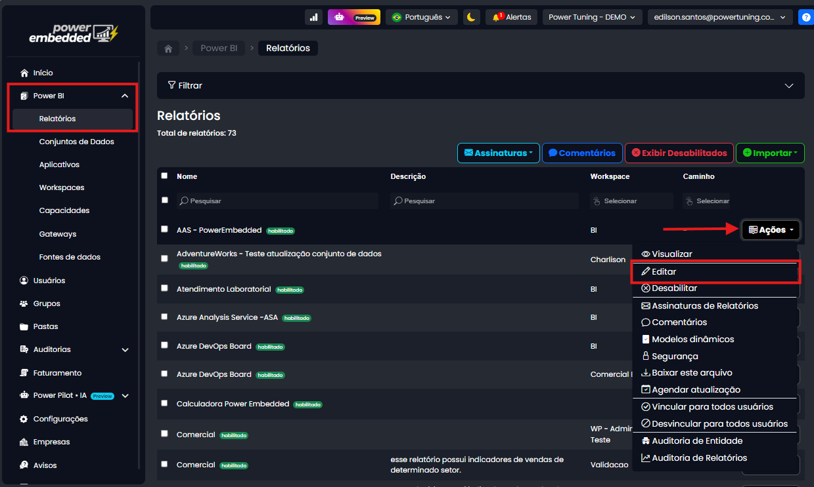

# Marca d'agua no relatório

#### Você saberia dizer quem tirou o print daquele relatório confidencial que vazou?

Em muitos cenários, relatórios do Power BI contêm dados estratégicos e sensíveis. Quando esses relatórios são compartilhados via prints, **não é possível identificar quem teve acesso ao conteúdo** — o que representa um risco significativo para a segurança da informação.

#### A solução: marca d’água personalizada por usuário

Pensando nisso, lançamos uma nova funcionalidade no Power Embedded: **marca d’água automática nos relatórios**, com o objetivo de aumentar a segurança e rastreabilidade dos acessos. Com essa funcionalidade, é possível exibir informações como:

* E-mail do usuário logado
* Data e hora do acesso

Tudo isso de forma discreta, porém visível, diretamente na interface do relatório.

#### Como ativar a marca d’água

**Passo 1: Acesse o portal de Administração**

Vá até aba de Power BI > Relatórios  > Ações

<figure><figcaption></figcaption></figure>

**Passo 2: Ative a permissão**

Selecione a permissão "Proteger print da Tela"

<figure><figcaption></figcaption></figure>

**Passo 3: Salve e visualize**

Clique em **Salvar** e abra o relatório para visualizar a marca d’água em ação.

Agora ao acessar o seu relatório, a marca d'água vai está aplicada

<figure><figcaption></figcaption></figure>

Benefícios da funcionalidade

* **Rastreamento de acessos:** identifique quem visualizou o relatório.
* **Prevenção de vazamentos:** desincentiva prints ou repasse indevido.
* **Segurança reforçada:** mais controle sobre quem vê e compartilha os dados.

#### Observações importantes

* A marca d’água aparece apenas dentro do Power Embedded, se o usuário tiver a permissão de exportar o PBIX essa marca d'água não se aplica.
* A exportação com marca d’água ainda não está disponível (em roadmap).
* Não é possível personalizar o conteúdo da marca por relatório.

&#x20;
