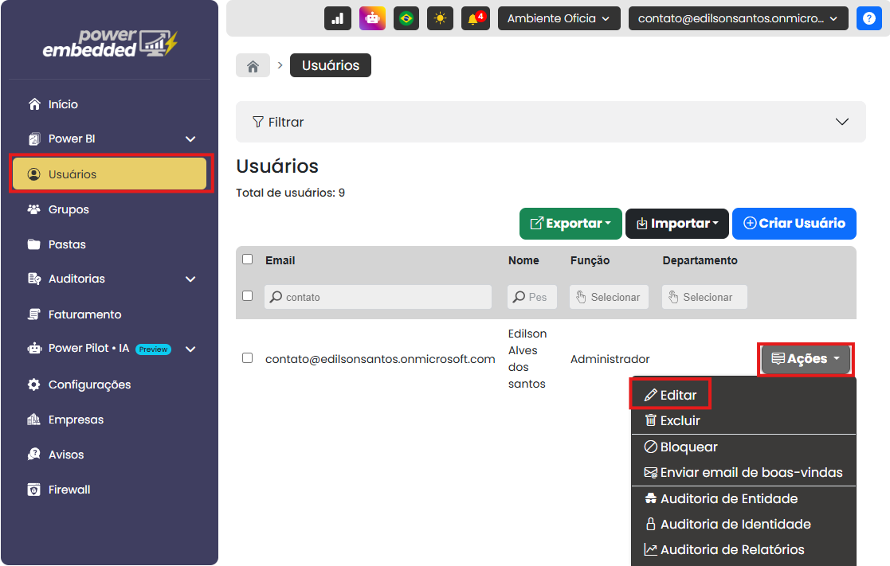

# Controle de gastos com Power Pilot: limite de uso mensal em dólar (USD)

### Controle de gastos com Power Pilot: limite de uso mensal em dólar (USD)

#### A funcionalidade de controle de gasto permite definir um **limite mensal de uso em dólar (USD)** para o Power Pilot, trazendo mais previsibilidade e tranquilidade para os usuários. Com essa funcionalidade, é possível utilizar a inteligência artificial com **mais confiança**, inclusive explorando modelos mais robustos, como o **GPT-4o**, sem correr o risco de ultrapassar o orçamento.

<figure><figcaption></figcaption></figure>

Entre os principais benefícios da funcionalidade estão:

* Definição de um **teto de custo** por **usuário**, **grupo**, **empresa** ou **organização**
* **Garantia de que o orçamento não será excedido**
* **Liberdade para testar e explorar** a IA sem surpresas na fatura

#### Como funciona

Cada vez que o Power Pilot é utilizado para responder perguntas, ele consome tokens de um modelo de IA — que têm um custo em dólar (USD). O Power Embedded monitora esse consumo automaticamente e compara com o limite definido pelo administrador.

#### Como configurar o limite de uso

Nesse passo a passo abaixo ele serve para explicar esse limite na hierarquia de usuário, mas lembrando que você consegue trabalhar na hierarquia de Grupos e Organização

**Passo 1: Acesse o portal de administração**

&#x20;Vá até o menu de "**Usuários"  e clique em ações**.

<figure><figcaption></figcaption></figure>

**Passo 2: Defina o limite mensal em USD**

Nessa nova tela, informe o valor máximo permitido para consumo de IA no mês (ex: 1 USD).

<figure><figcaption></figcaption></figure>

**Paso 3: Salve e monitore**

Após salvar, o sistema começa a monitorar automaticamente o uso do Power Pilot. O consumo pode ser acompanhado em tempo real na mesma tela.

<mark style="color:red;">**É importante destacar que o Power Embedded já conta atualmente com uma auditoria detalhada de uso do Power Pilot, permitindo que o cliente acompanhe o consumo por assistente, modelo utilizado e usuários. A nova funcionalidade de limite de uso por custo vem para complementar essa auditoria, oferecendo um nível adicional de controle e garantindo mais segurança no uso da IA.**</mark>

#### O que acontece ao atingir o limite?

* O acesso ao Power Pilot é temporariamente suspenso para o escopo configurado.
* O uso é liberado novamente no início do próximo ciclo mensal.

#### Regras de Limite de Consumo do Power Pilot

Para garantir controle e previsibilidade no uso da IA, o sistema segue uma hierarquia de regras para aplicar os limites de consumo definidos:

* **Limite da Organização (Hard Limit):**\
  É o valor máximo absoluto. A **soma total do consumo de todos os usuários** nunca poderá ultrapassar esse limite. Independentemente de configurações individuais ou por grupo, esse é o teto global da organização.
* **Limite por Grupo:**\
  O sistema identifica todos os grupos aos quais o usuário pertence e considera **apenas o grupo com o maior limite entre eles**. A **soma do consumo do usuário** não pode ultrapassar o limite desse grupo prioritário.
* **Limite Individual do Usuário:**\
  Cada usuário também pode ter um limite específico. Nesse caso, a **soma do uso individual nunca pode ultrapassar o seu próprio limite**, mesmo que o grupo ou a organização permitam um consumo maior
