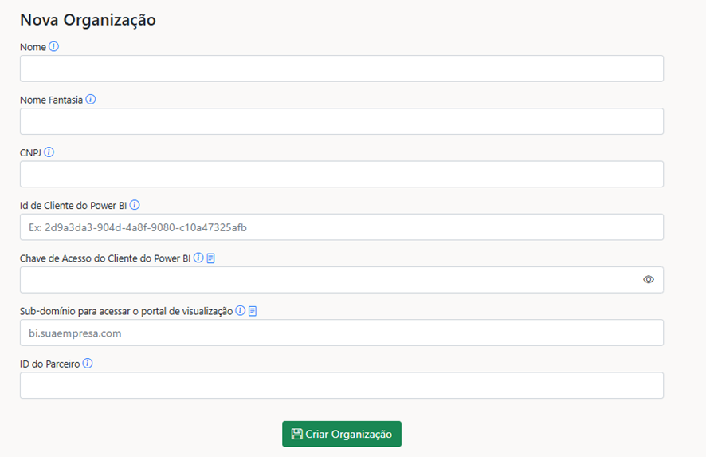

# Acesso de Usuário externo como Administrador ou Contribuidor no Power Embedded

Usuários de fora da sua organização também podem acessar o Portal Power Embedded e atuar como Administradores, Contribuidores ou Contribuidores de Workspace. Para isso, é necessário seguir alguns passos simples.

**Etapa 1 - Convidar o Usuário Externo**

Antes de liberar o acesso, o usuário precisa ser convidado para o seu tenant (ou seja, para o ambiente da sua empresa).

Siga as instruções para enviar o convite ao e-mail do usuário. [Convidar usuário externo para acessar o portal de administração](https://docs.powerembedded.com.br/portal-de-administracao/usuarios/convidar-usuario-externo-para-acessar-o-portal-de-administracao)

**Etapa 2 - Criar o Usuário no Portal**

Depois que o convite for aceito:

1-    Acesse o Portal Power Embedded

2- Vá até a área de Usuários e crie o novo usuário, não importar do EntraId. ([Novo Usuário - Portal de Administração](https://admin.powerembedded.com.br/Users/Create)).

Durante a criação, atribua a função desejada: **Administrador, Contribuidor ou Contribuidor de Workspace.**

**Etapa 3 – Acesso ao Portal**

Após o usuário ser criado, ele poderá fazer login no Portal de Administração seguindo os passos abaixo:

### Como fazer o login no Portal de Administração

1. Acessar o Portal Power Embedded [Power Embedded - Portal de Administração](https://admin.powerembedded.com.br/)
2. O usuário vai clicar em “Opções de Entrada” e selecionar a opção de “Entrar em uma organização”.

<figure><figcaption></figcaption></figure>

<figure><figcaption></figcaption></figure>

3. &#x20;Digite o domínio do Tenant (exemplo: minhaempresa.com.br)

<figure><figcaption></figcaption></figure>

4. Insira o e-mail da conta criada

<figure><figcaption></figcaption></figure>

5. Um código de verificação será enviado para esse e-mail, insira o código e clique em Entrar

<figure><figcaption></figcaption></figure>

### Pronto!

Depois de seguir esses passos, o usuário externo estará conectado ao portal e com as permissões definidas (Administrador, Contribuidor ou Contribuidor de Workspace).

### Atenção!

Usuário externo com função de **“Visualizador”** não é necessário convidar para organização, é realizado somente o cadastro na plataforma.
