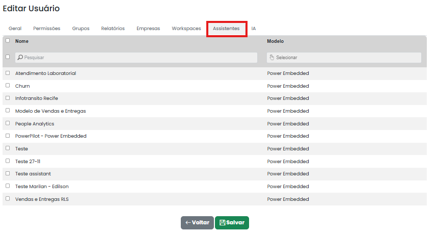

# Assistentes

Nesta aba, é possível definir **quais assistentes do Power Pilot o usuário terá acesso**. Basta marcar os assistentes desejados na lista para que fiquem disponíveis para o usuário ao utilizar o sistema.

<figure><figcaption></figcaption></figure>

