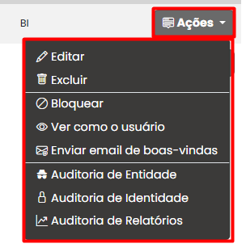

# Botão de Ações em usuários

O botão de **"Ações"** na tela de **Usuários** exibe um menu com diversas funcionalidades administrativas relacionadas ao gerenciamento individual dos usuários cadastrados no sistema.

<figure><figcaption></figcaption></figure>

1. **Editar:** \
   Permite alterar informações do usuário, como nome, e-mail, departamento, permissões e etc.\

2. **Excluir:** \
   Remove o usuário do sistema de forma permanente. Ideal para contas que não serão mais utilizadas.\

3. **Bloquear:** \
   Impede o acesso do usuário ao sistema sem excluí-lo. Útil em casos de inatividade temporária ou segurança. Lembrando que, usuários bloqueados contabiliza no pagamento.\

4. **Ver como usuário:** \
   Permite que ao administrador enxergar exatamente quais relatórios, aplicativos e permissões estão disponíveis para aquele perfil, além de facilitar a identificação de problemas relacionados à segurança, como erros de RLS (Row-Level Security) ou acessos incorretos.\

5. **Enviar email de boas - vindas:**\
   Reenvia o e-mail de boas-vindas padrão com instruções de acesso e login. Pode ser usado quando o usuário não recebeu ou perdeu a mensagem original.\

6. **Auditoria de Identidade:**\
   Exibe o histórico de interações e modificações feitas por esse usuário em relação a objetos do sistema. \

7. **Auditoria de Identidade**\
   Mostra logs de autenticação, como tentativas de login. \

8. **Auditoria de Relatórios:**\
   Apresenta o histórico de acesso e uso de relatórios.
