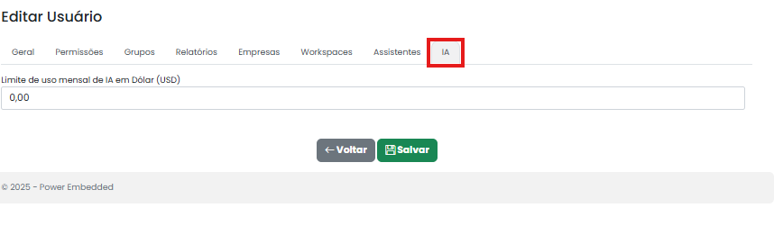

# IA

A aba **IA** permite configurar o **limite de custo em dólar** que o usuário pode utilizar dos assistentes. Essa configuração ajuda a controlar e evitar gastos excessivos com o uso de recursos que envolvem chamadas a modelos de IA.

<figure><figcaption></figcaption></figure>

Existe algumas regras em relação a esse controle de custo, para entender melhor acesse o link abaixo:


[controle-de-gastos-com-power-pilot-limite-de-uso-mensal-em-dolar-usd.md](../power-pilot-ia/controle-de-gastos-com-power-pilot-limite-de-uso-mensal-em-dolar-usd.md)

