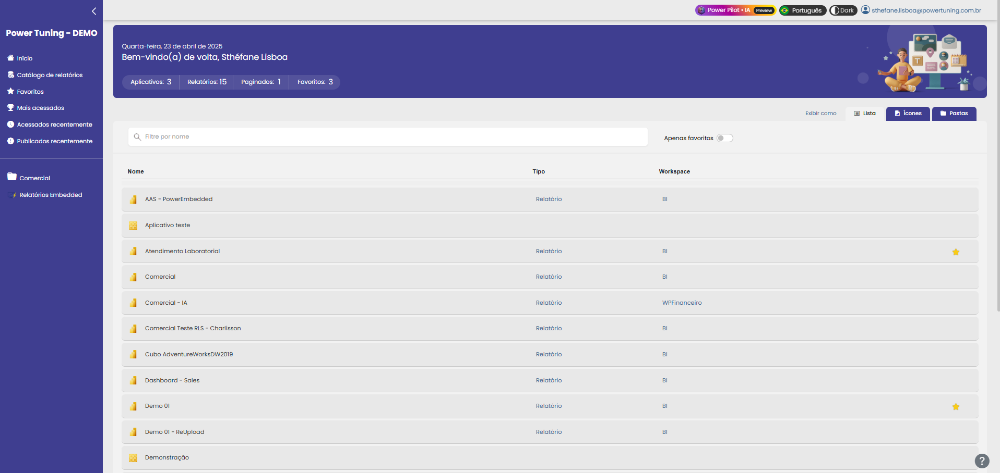
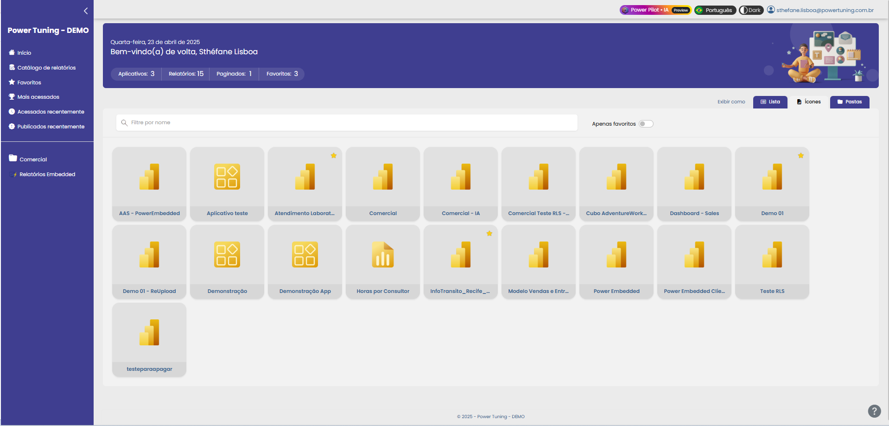
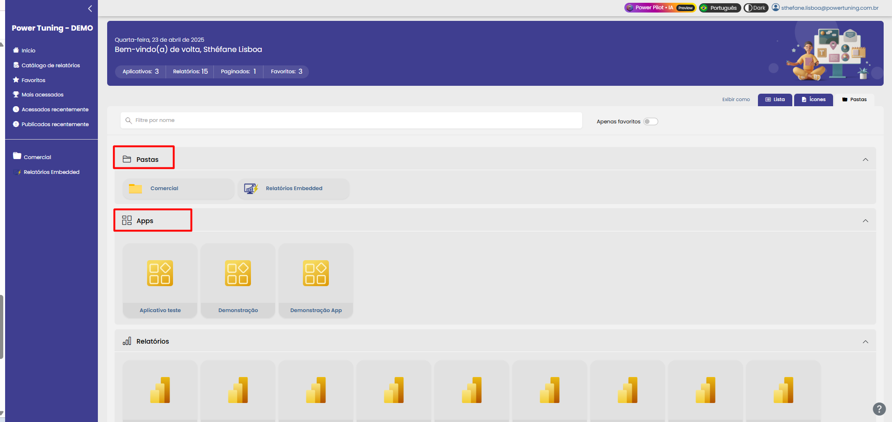

# Portal de Relatórios



### Portal de visualização

O portal de visualização é o ambiente onde o usuário pode acessar relatórios, aplicativos, relatórios paginados e dashboards.&#x20;

Trata-se de um portal white-label, o que significa que pode ser totalmente personalizado conforme a identidade visual dos clientes.

Além disso, é um portal multi-idiomas, ideal para cenários internacionais e com tema dark/light mode.&#x20;

<figure><figcaption></figcaption></figure>

No início, o usuário já tem acesso a algumas métricas dos painéis disponíveis e pode clicar para ser redirecionado diretamente a eles. No mesmo menu, é possível escolher entre três tipos de visualização de relatórios:

**Lista**: Uma visualização similar à do workspace do Power BI.

<figure><figcaption></figcaption></figure>

**Ícones**: Muito útil quando o usuário tem acesso a vários relatórios e precisa identificar cada um de forma rápida.

<figure><figcaption></figcaption></figure>

**Pastas**: Esta visualização oferece uma organização mais clara do ambiente, permitindo visualizar as pastas onde os relatórios estão inseridos e também a divisão entre Relatórios, Aplicativos e painéis de forma individual.

<figure><figcaption></figcaption></figure>

Para facilitar a busca por esses relatórios, é possível pesquisar pelo nome específico ou até mesmo filtrar para exibir apenas os relatórios marcados como favoritos.

### Funcionalidades do menu lateral

**Catálogo de relatórios**: É uma ferramenta de descoberta que permite divulgar os relatórios disponíveis na empresa. Com ela, os usuários podem visualizar quais relatórios já existem e, caso identifiquem algum relevante para suas atividades diárias, podem solicitar acesso de forma prática e centralizada. &#x20;

**Favoritos:** Os relatórios favoritos do usuário logado podem ser facilmente marcados com uma estrela ao lado do relatório.

**Mais Acessados:** Exibe os relatórios mais acessados pelo usuário.

**Acessados Recentemente:** Lista os relatórios que o usuário acessou recentemente.

**Publicados Recentemente:** Mostra os relatórios recentemente publicados aos quais o usuário logado tem acesso.

No menu lateral, além das informações mencionadas acima, é possível visualizar as pastas.
