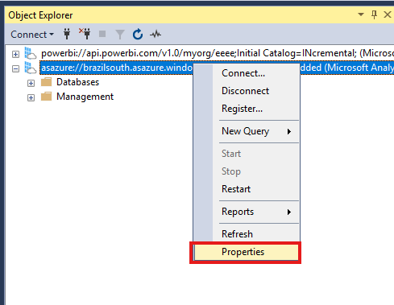

# Creating embed token for accessing dataset 947115a2-4a47-416f-a3d1-d4f2232a66f1 requires username to

<figure><figcaption></figcaption></figure>

#### Passo 1: Conectar ao Servidor via SSMS

**1.1. Obter o Server Name**

1. Acesse o **Azure Portal**.
2. Vá até o recurso **Azure Analysis Services**.
3. No menu **Overview**, copie o **Server Name**.

<figure><figcaption></figcaption></figure>

**1.2. Conectar no SSMS**

1. Abra o **SQL Server Management Studio (SSMS)**.
2. Clique em **Conectar** e selecione a opção **Analysis Services**.

<figure><figcaption></figcaption></figure>

3. No campo **Server Name**, cole o valor copiado anteriormente, Insira suas credenciais no campo **Username** e clique em **Conectar**.

<figure><figcaption></figcaption></figure>

**1.3. Adicionar o Service Principal**

1. Após a conexão, clique com o botão direito sobre o servidor e selecione **Propriedades**.

<figure><figcaption></figcaption></figure>

2. Na nova janela, vá até a guia **Segurança e** Clique em **Add** para adicionar um **Service Principal**.

<figure><figcaption></figcaption></figure>

3. Em **Manual Entry**, insira o service principal no seguinte formato:  app:AppicationClientID@DirectoryTenantID

<figure><figcaption></figcaption></figure>

<details>

<summary>Passo 2: Obter o Application Client ID e Directory Tenant ID</summary>


* No **Azure Portal**, acesse **Microsoft Entra ID**.

\


* No menu lateral, clique em **App Registrations** (Registro de Aplicativos) e busque pelo **service principal** criado durante a instalação do portal (por padrão, o nome é **PowerEmbedded-app**).


* Copie os seguintes valores:
  * **Application Client ID**
  * **Directory Tenant ID**

.png>)


*   Monte a string no formato correto:

    ```
    App<ApplicationClientID>@<DirectoryTenantID>
    ```

    Exemplo:

    ```
    app:436fed95-c8bc-4e1a-92d7-99a52c353675@ec50c6a3-b95c-4f22-8424-318f1cd459c6
    ```
* Volte ao **SSMS**, cole esse valor no campo **Manual Entry** e clique em **Add**.

.png>)\


* Confirme as alterações clicando em **OK**.

.png>)

</details>

Feito esse processo nós acabamos de adicionar o PowerEmbedded-app com administrador do Azure Analysis Service, o próximo passo é acessar o Azure novamente e copiar o ObjectID e colar no portal de administração do Power Embedded


<details>

<summary>Passo 3: Configurar o Service Principal no Portal</summary>


* No **Azure Portal**, acesse novamente o **Microsoft Entra ID**.


* Vá até **Enterprise Applications ou Aplicativos empresarias**&#x20;

.png>)

* Busque pelo **PowerEmbedded-app** e clique sobre ele e copie o **Object ID**.

.png>)


* Acesse o **Portal de Administração do Power Embedded e** vá até **Configurações** e cole o **Object ID** no campo **ID de Objeto do Service Principal (Azure Analysis Services)**.

.png>)\


* Salve as alterações.

</details>
